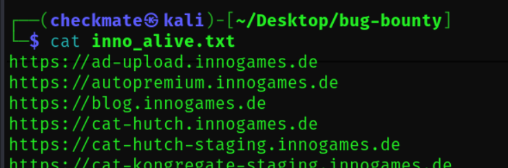

# Identifying website tech
- https://www.wappalyzer.com/lookup/
- https://builtwith.com/
- https://securityheaders.com/
- nmap

Tip: Follow redirect

# Finding directories
**Tools**
- ffuf: `ffuf -w /usr/share/wordlists/dirbuster/directory-list-2.3-medium.txt:fuzz -u http://10.0.2.8/fuzz`
- dirb
- dirbuster

# Subdomain enumeration
- google: 
- www.crt.sh
- subfinder: 
- assetfinder: 
- amaas: 

# Check what is alive
## **Tools:**
 **httprobe**: 
 

## **Take screenshot:**