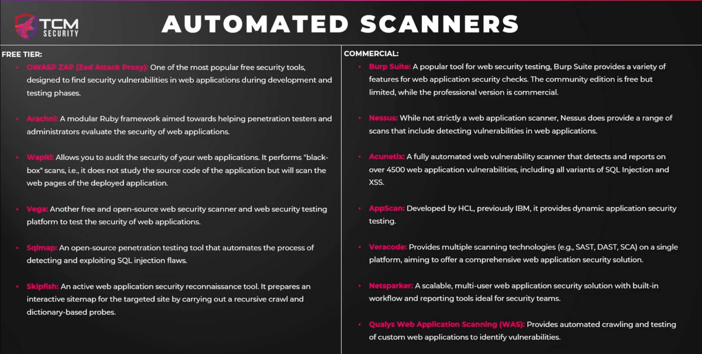
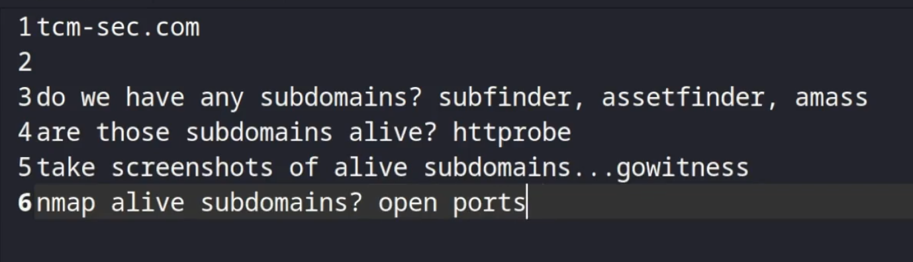
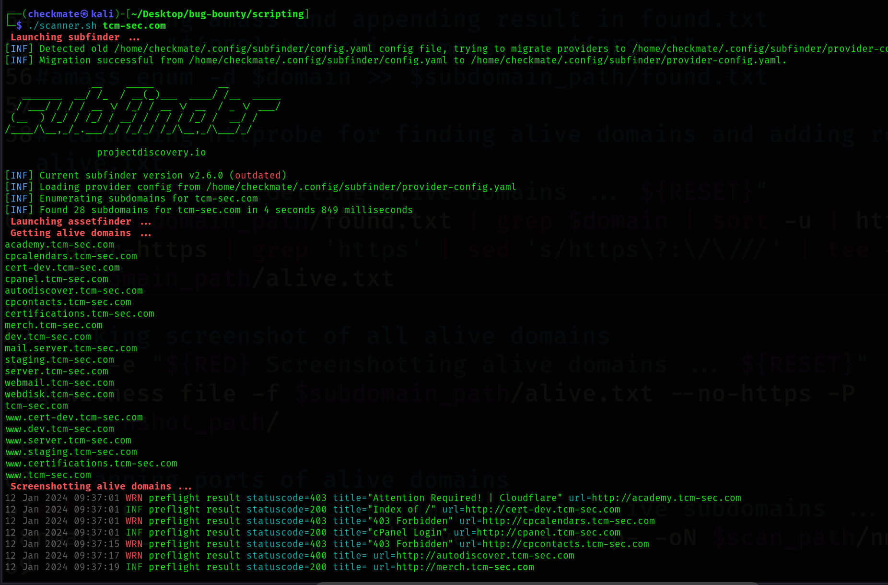

# Burp extensions
1. Active Scan++
2. Retire.js
and many more.

- Automated scanners mostly scratch the surface (10% - 20% findings) and don't rely on it. 
- Always check rules in programs whether they allowed automated scanners or not.
- Some free tools like sqlmap, XXStrike etc. can help in finding things but always make sure not firing many request at a time otherwise you might get yourself blocked or locked.


# Automating scanning, findings
- Use bash, python etc.
- Write logic of using the tools cmd which you use manually.
 
 ```bash
 #!/bin/bash

# defining domain as the first argument of command
domain=$1


RED="\033[1;31m" # makes text color red
RESET="\033[0m" # Reset the color 

# defining directories path for domain
subdomain_path=$domain/subdomains
screenshot_path=$domain/screenshots
scan_path=$domain/scans


# creating directories if not present
if [ ! -d "$domain" ];
then
	mkdir $domain
	echo -e "${RED} [+] Created ${domain} folder ${RESET}"
fi


if [ ! -d "$subdomain_path" ];
then
	mkdir $subdomain_path
	echo -e "${RED} [+] Created ${subdomain_path} folder ${RESET}"
fi	


if [ ! -d "$screenshot_path" ];
then
	mkdir $screenshot_path
	echo -e "${RED} [+] Created ${screenshot_path} folder ${RESET}"
fi


if [ ! -d "$scan_path" ];
then
	mkdir $scan_path
	echo -e "${RED} [+] Created ${scan_path} folder ${RESET}"
fi


# launching subfinder and adding results in found.txt
echo -e "${RED} Launching subfinder ... ${RESET}"
subfinder -d $domain > $subdomain_path/found.txt

# launching assetfinder tool and appending results of domain in found.txt
echo -e "${RED} Launching assetfinder ... ${RESET}"
assetfinder $domain | grep $domain >> $subdomain_path/found.txt


# launching amass and appending result in found.txt
#echo -e "${RED} Launching amass ... ${RESET}"
#amass enum -d $domain >> $subdomain_path/found.txt

# launching httprobe for finding alive domains and adding result in alive.txt
echo -e "${RED} Getting alive domains ... ${RESET}"
cat $subdomain_path/found.txt | grep $domain | sort -u | httprobe -prefer-https | grep 'https' | sed 's/https\?:\/\///' | tee -a $subdomain_path/alive.txt

# taking screenshot of all alive domains
echo -e "${RED} Screenshotting alive domains ... ${RESET}"
gowitness file -f $subdomain_path/alive.txt --no-https -P $screenshot_path/

# scanning ports of alive domains
echo -e "${RED} Launching nmap scan on alive subdomains ... ${RESET}"
nmap -iL $subdomain_path/alive.txt -T4 -p- -oN $scan_path/nmap.txt
```
