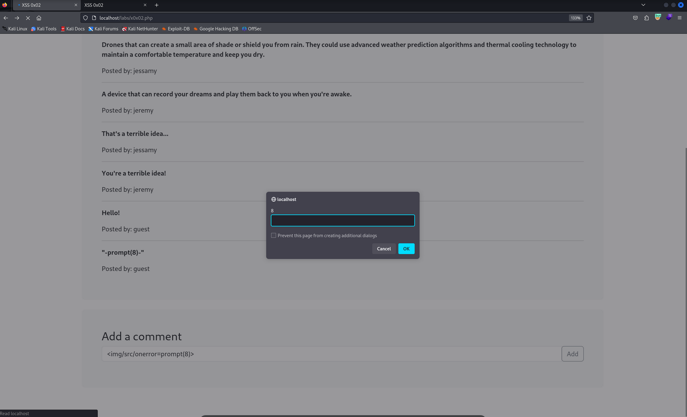

Cross-site scripting is a type of security vulnerability that can be found in some web applications. XSS attacks enable attackers to inject client-side scripts into web pages viewed by other users. A cross-site scripting vulnerability may be used by attackers to bypass access controls such as the same-origin policy.

# Types

# Payloads List
https://github.com/payloadbox/xss-payload-list

If xss gets executed on website, it can be used to inject malicious code to perform malicious things like keylogging, account takeover by stealing cookies etc. All attacker have to do is to create a javascript function for that and it will get executed on client side without client being aware of.

If xss injected page is accessed publicly then it can cause more damage as attacker will get access to multiple clients.

Like this, an xss payload ``  is added as a comment on post which will automatically render for other user if they visit the post.
Here due to prompt function, xss is visible but if attacker writes some malicious function, it can cause severe damages to clients.

