# File Inclusion
## Local file inclusion
### Lab 1
https://github.com/swisskyrepo/PayloadsAllTheThings/tree/master/File%20Inclusion

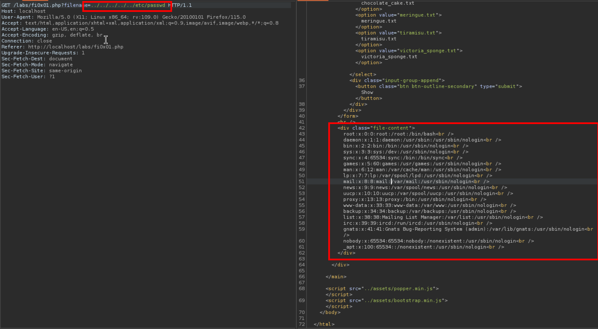
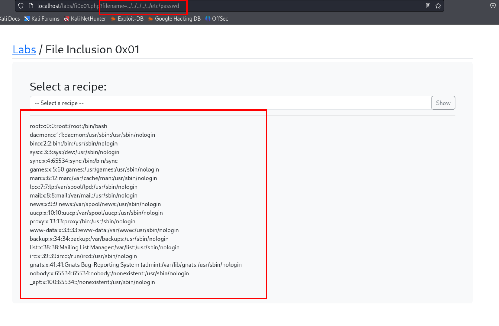

### Lab 2
Recursive filter bypass:
`..././..././..././..././etc/passwd`
removal chars is quoted.
`."../"./."../"./."../"./."../"./etc/passwd`
After removing `../` from above we get
`../../../../etc/passwd` -> valid directory file

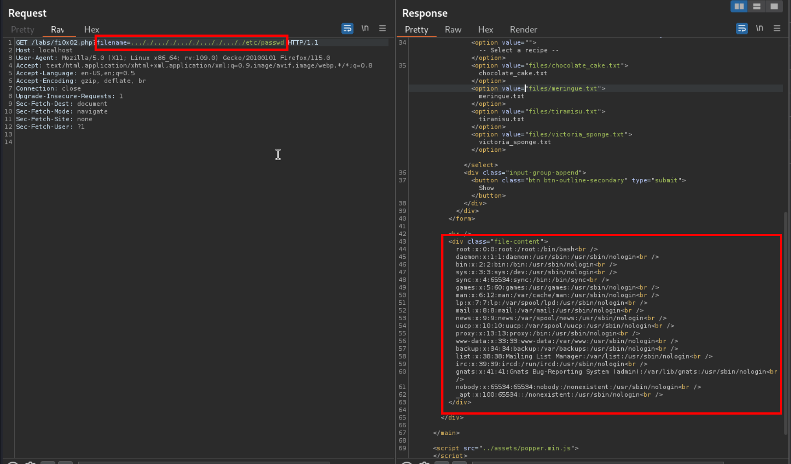

## Remote file inclusion
Fetching remote files with server.
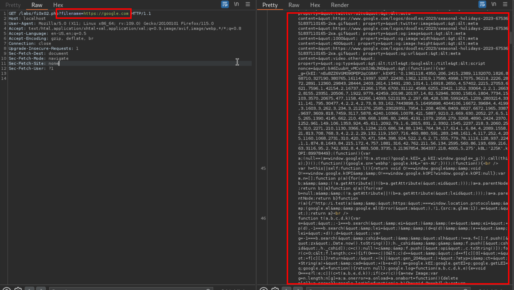

### Getting local files with bypassing filters etc
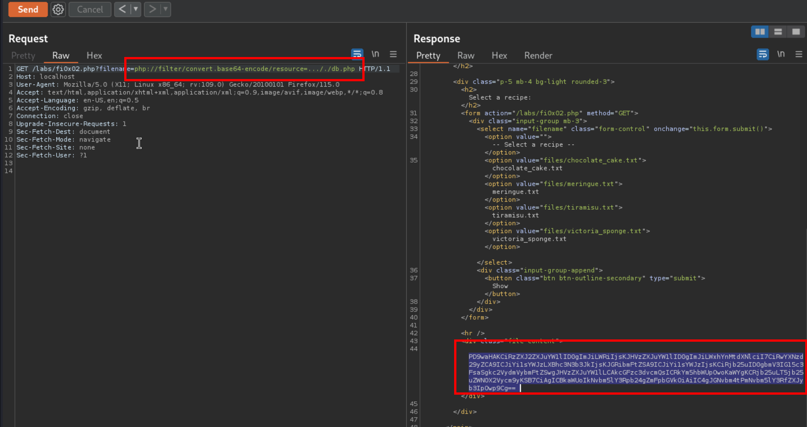

#### Base64 decoded
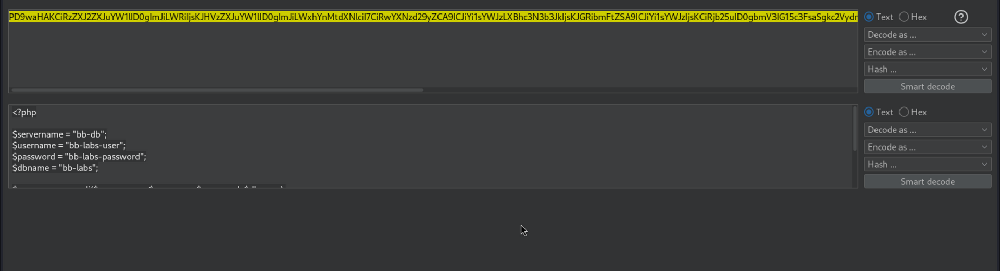

# Remote Inclusion challenge lab
Solved using LFI file list using ffuf
**Size: 922 payload worked**

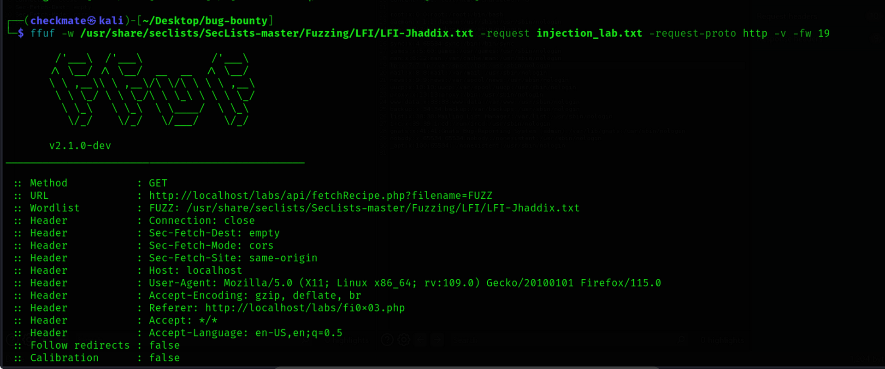
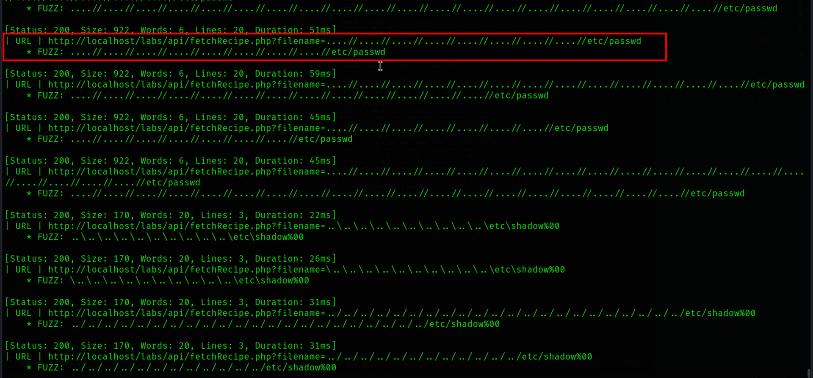
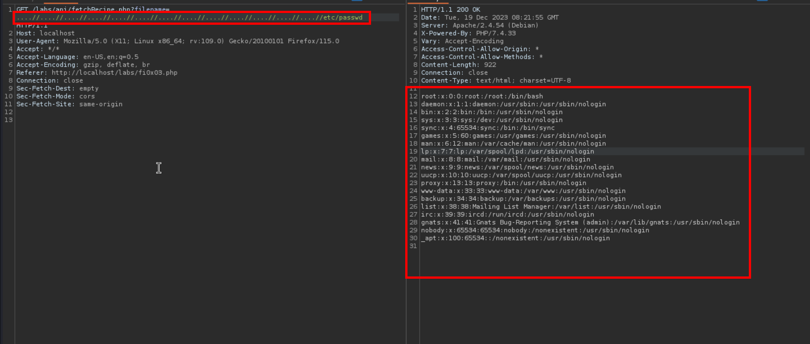

# SQL Injection
Basics:
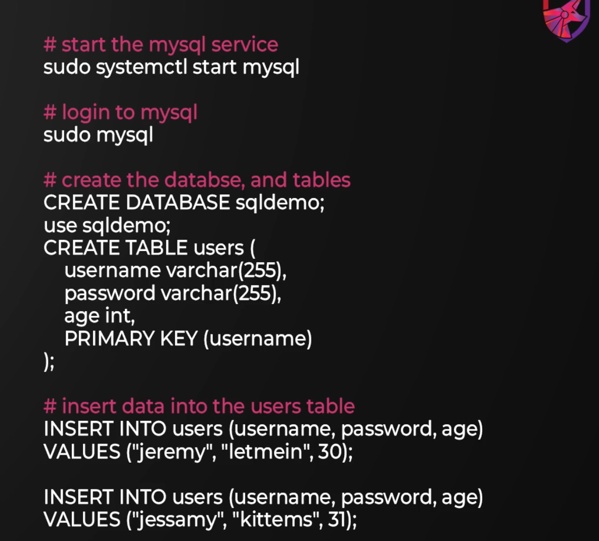

Starting mysql:
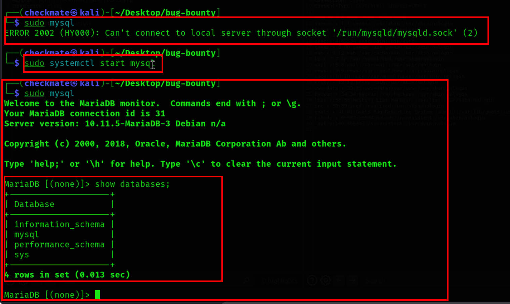