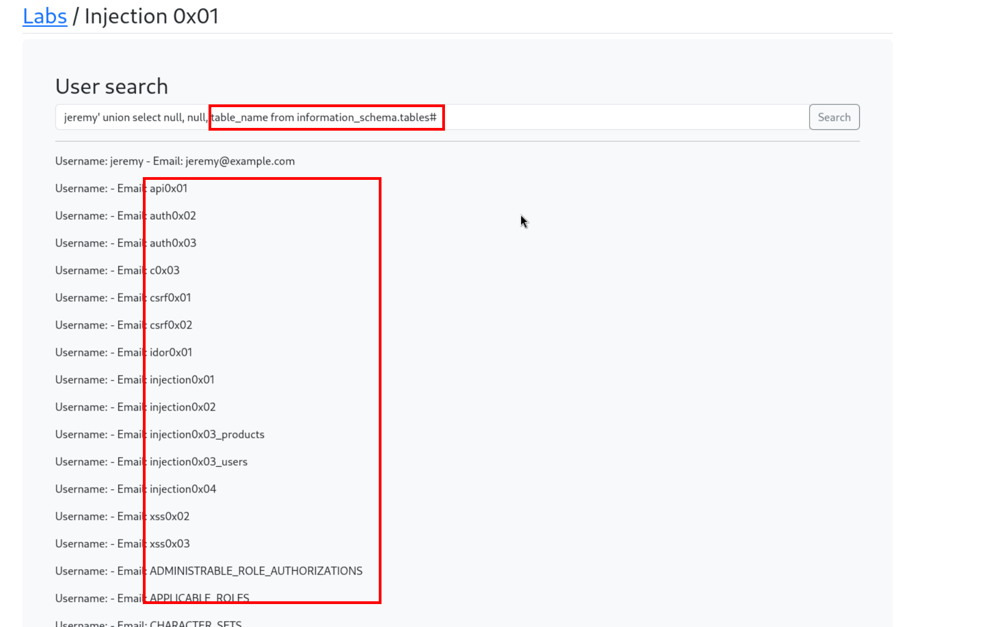
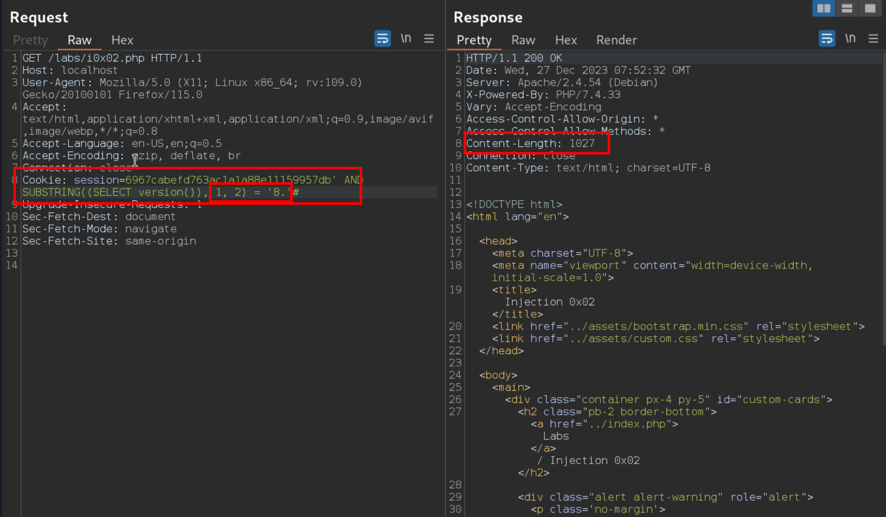
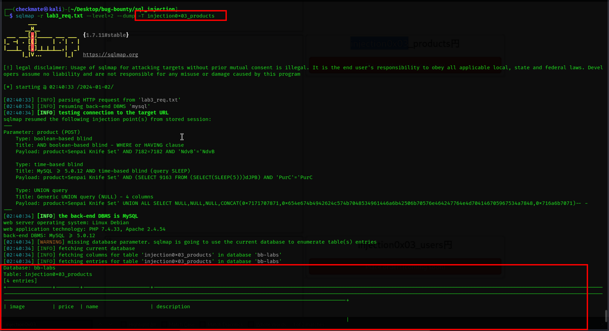

# Basics

***breaking queries and injecting sql***  
**"#" is statement terminator for MySQL.  
This depends on distributions of SQL**  

**Getting version**  

**Extracting table names**  

***Resource:*** https://portswigger.net/web-security/sql-injection/cheat-sheet

# Using tools to check sql injection

## SQLmap

Request file:  
  
  

**Checking headers content for injection**  

**Asking true/false questions with request and enumerating info**  
*Here sql version:*  
Invalid content-length = 1928  
Valid = 1027  

- Valids  
      
      
    

*Extracting password*  

Sending in intruder and attacking it.  
  

*Using sqlmap*  
  
  

- dumping all tables data  
    
    
- dumping specific table  
    
    

# Challenge Lab 3
- Product parameter is sql injectable
**Union select:**

**Getting table names**

***Use sqlmap to dump all data***

# Second order sql injection
- Basically, if there is any input field from any sort of page like register, etc which is being rendered later on then you can try entering sql injection payloads to later on see if application is sql injectable or not.

**Normal username payload account**

No bio.

**SQL Injected username payload**

Got bio from injected payload.

https://book.hacktricks.xyz/pentesting-web/sql-injection/sqlmap/second-order-injection-sqlmap

