10. Scanning & Enumeration

# 1. Installing kipotrix
username: john
password: TwoCows2

to get ip:
ping 8.8.8.8

# 2. Scanning with Nmap
### To discover kioptrix in network:
arp-scan -l
netdiscover -r <ip_net><subnet_slash>

### Scan using nmap
basic 3 way handshake: SYN SYNACK ACK
nmap stealth: SYN SYNACK RST (reset) (don't connect)

stealth flag is by default which is used to not get detected while scanning. It resets the connection once after SYNACK

## Command
`nmap -T4 -p- -A <ip>`
`T4` : for speed (threads) (higher greater detection)
`-p-`: scan all ports from 1 to 65536
`-A`: to get all info like what system, versions, etc.

Scan Result gives open ports with services running along versions, etc.
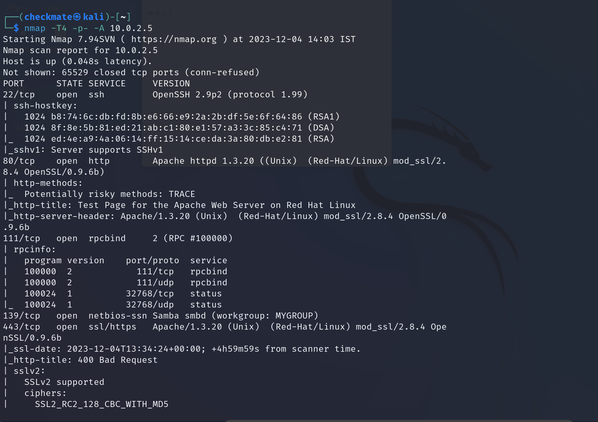

### Enumerating port 80/443 (web) using nikto tool
`nikto -host http(s)://<ip>`
RESULT:
```txt
nikto -host http(s)://<ip>
```

### Busting directories using dirbuster
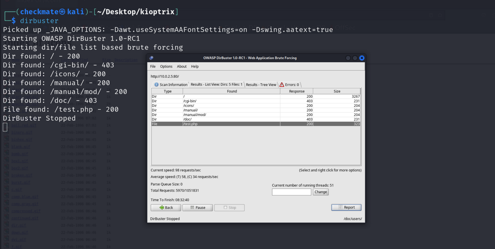

Other tools:
dirb, gobuster

Sometimes, error page appears in url for `\usage`
so try `\usage\`  means \ after for cross checking it.
# Enumerating SMB
SMB = Samba (file sharing across Windows and Linux)
#### Tool: msfconsole (metasploit):
1. Run `msfconsole`
2. Use `search smb`
	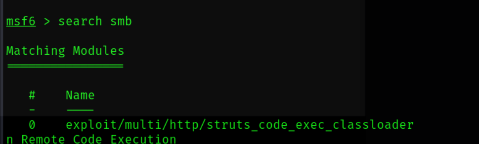
	Here smb related modules will be displayed.
	Select which module you're interested.
3. Select: `use <module_name> or <no.>`
	
4. Type: `info` or `options` to get options info required to use module.
	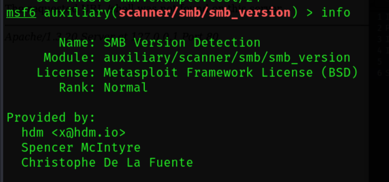
	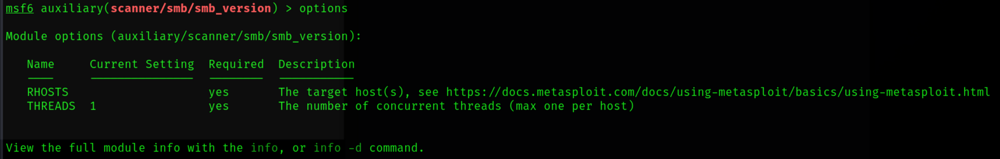
5. Set Options: `set <option_name> <value>`
	
6. Run: `run` to know results
	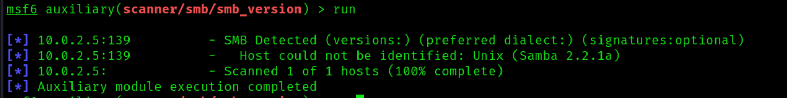
	
SMB version module is selected above and it identified it's version.
Now, using that version you can search for exploit and exploit it.

### Tool: smbclient
To get into smb for info.
#### Get info->
`smclient -L <host>`
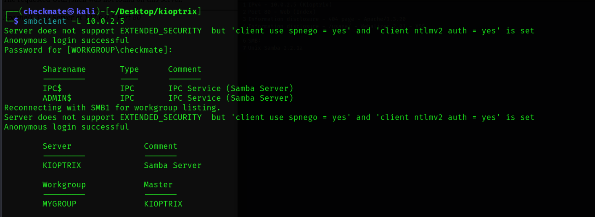
 #### Go to specific sharename
`smbclient \\\\<host>\\<sharename>`
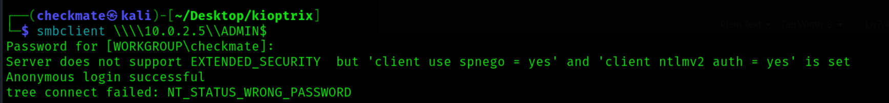
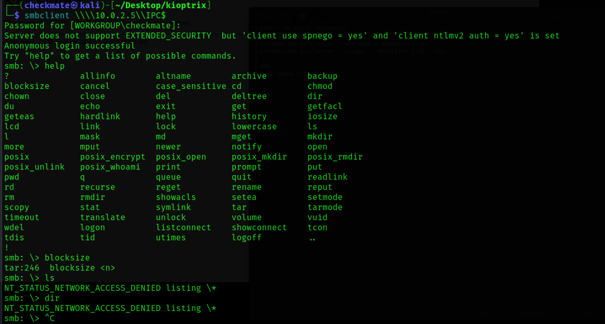

# Enumerating SSH
Sometimes info is exposed like version, ran by xyz, etc.
### Connect:
 `ssh <host>`

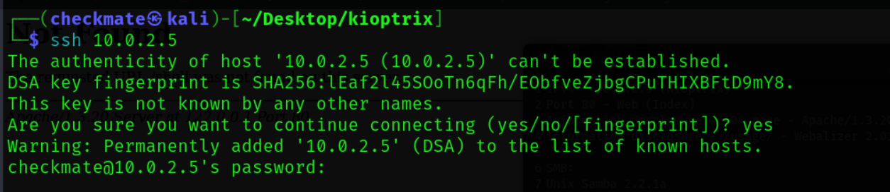

When offers:
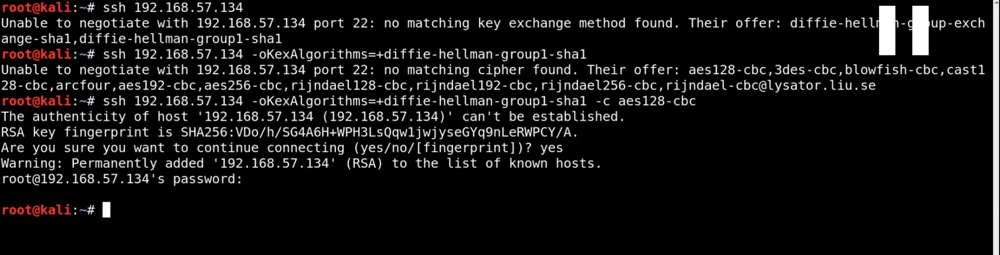

# Researching Vulnerabilities
### Search on google:
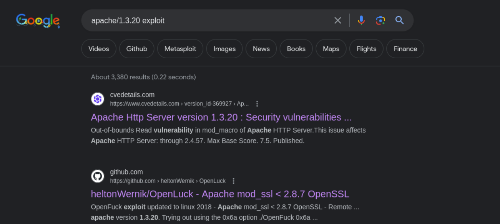

### Use searchsploit tool
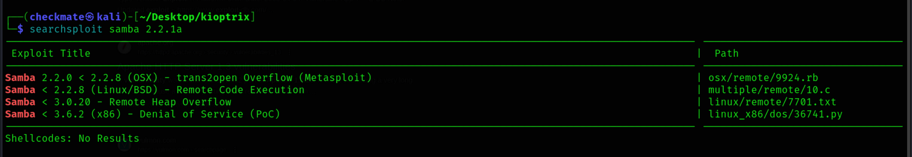
Don't be specific. the more you'll, the less will be result as it will be strictly matching and returning the result so use only module name etc.
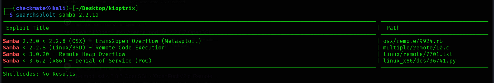
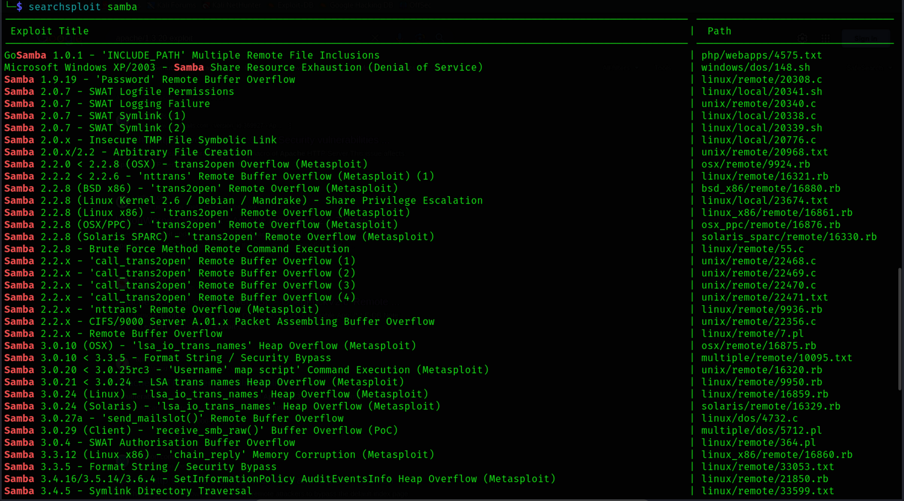
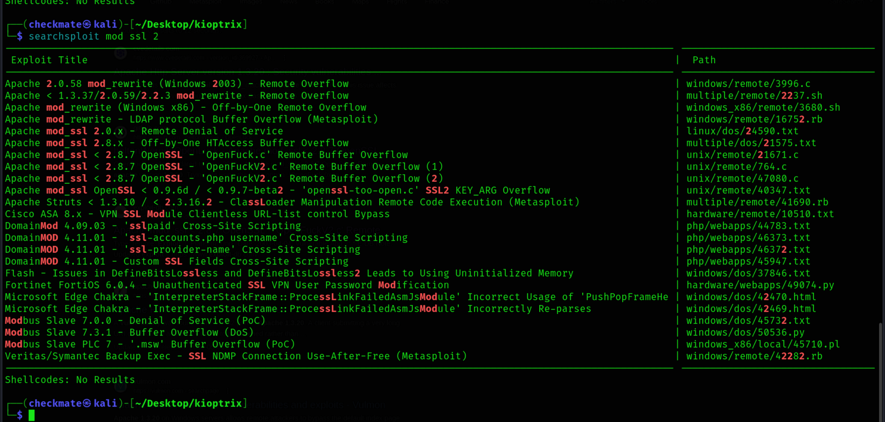


```txt
IPv4 - 10.0.2.5 (Kioptrix)
Port 80 - Web (Index)
Information disclosure - 404 page - Apache/1.3.20
Information disclosure - /usage/ - Webalizer 2.01 - XSS

80/tcp    open  http        Apache httpd 1.3.20 ((Unix)  (Red-Hat/Linux) mod_ssl/2.8.4 OpenSSL/0.9.6b)


SMB:
Unix Samba 2.2.1a

SSH
OpenSSH 2.9p2 (protocol 1.99)

Webalizer 2.01 

(80/443) OpenFuck exploit updated to linux 2018 - Apache mod_ssl < 2.8.7 OpenSSL - Remote Buffer Overflow   which may allow remote shell
	- (https://github.com/heltonWernik/OpenLuck) (may not work due to outdated)
	-(https://www.exploit-db.com/exploits/764) (github may be updated)


Apache/1.3.20
Many critical vulnerabilities
	- https://www.cvedetails.com/vulnerability-list/vendor_id-45/product_id-66/version_id-369927/Apache-Http-Server-1.3.20.html

Samba 2.2.1a
Many crictical vulnerabilities, buffer overflow, remote code execution
	- https://www.exploit-db.com/exploits/10 (remote code)
	- https://www.exploit-db.com/exploits/7 (remote buffer)
	- https://www.cvedetails.com/vulnerability-list/vendor_id-102/product_id-171/version_id-373318/Samba-Samba-2.2.1a.html (list of critical vulns)


openssh 2.9p2
Many critical vulns, remote code, buffer overflow
	- https://www.cvedetails.com/vulnerability-list/vendor_id-97/product_id-585/version_id-369523/Openbsd-Openssh-2.9p2.html (list of vulns)
	- https://www.exploit-db.com/exploits/21402 (token overflow)
	- Interesting results from `searchsploit openssh`.
	
	
Webalizer 2.01
Gain access to system by PHP code execution
	- https://www.cvedetails.com/cve/CVE-2002-0180/ (high)
	- https://www.exploit-db.com/papers/13017 (exploit system)
```