12. Exploitation Basics

# Shell
### Reverse shell (95% time using)
We connect to the target | A victim connect to us
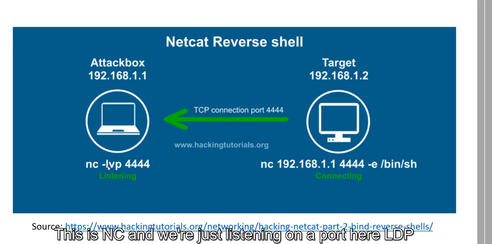

### Bind shell 
We connect to victim.
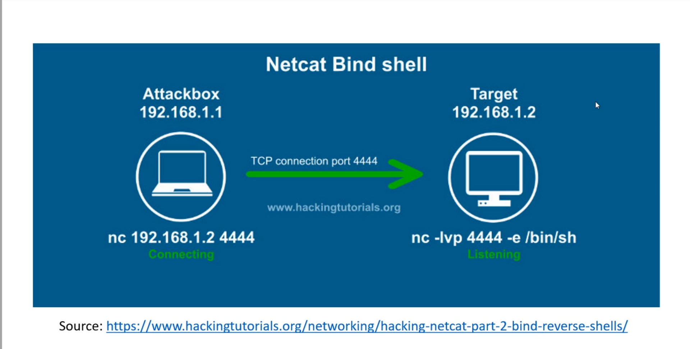

# Payload
Code sent for exploitation
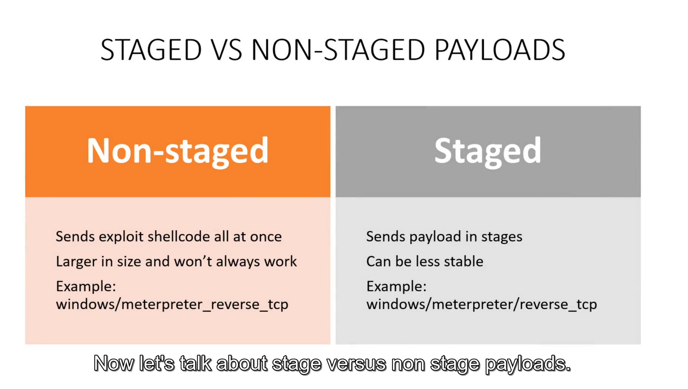

# Exploiting samba (trans2open) using metasploit

1) Run msfconsole
2) search trans2open which we found in scanning & enumeration!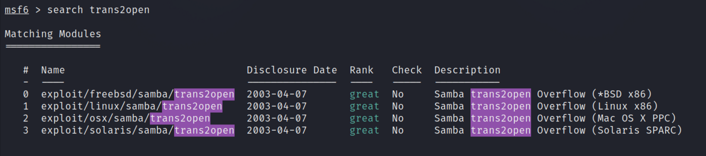
3) use linux one as we already found in scanning.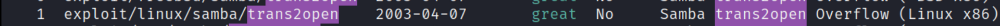
4) Type `options`, then set options using `set`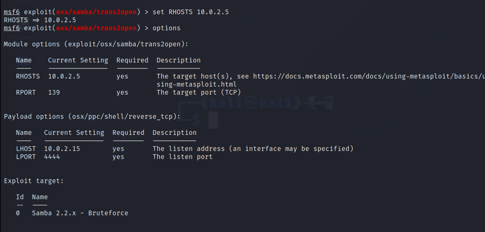
5) Type run to exploit
6) If not working , set different payload for that using `set payload <dir>`. Type payload dir and hit tab to get list of available ones and then complete the command.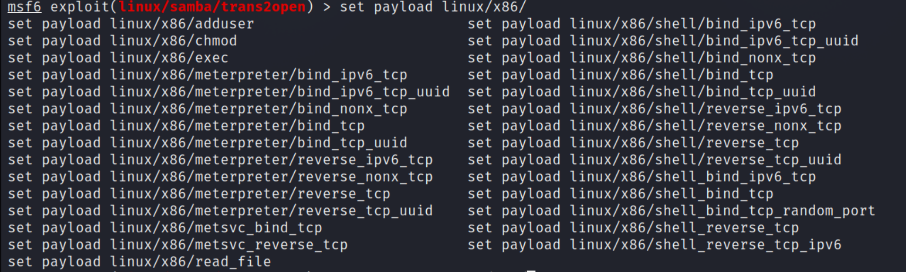
**woah🎉🎉🎉** got access  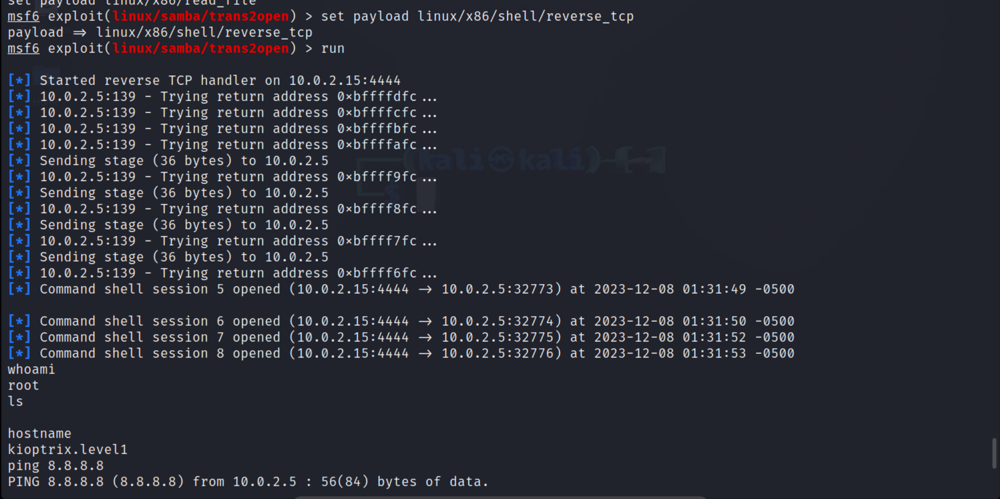
command history executed from attack is showing in machine.
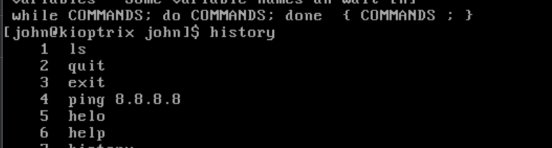

# Manual Exploitation
exploiting with trans2open we got on github.
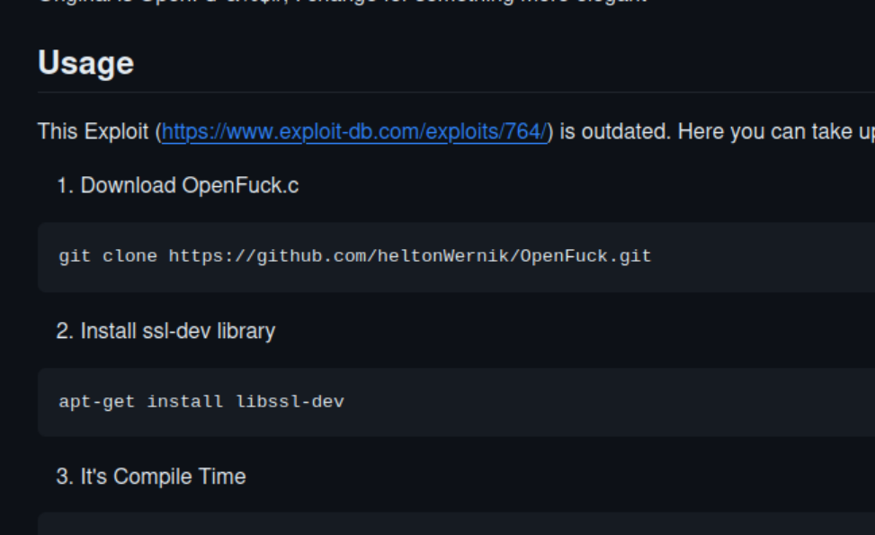

### just follow usage
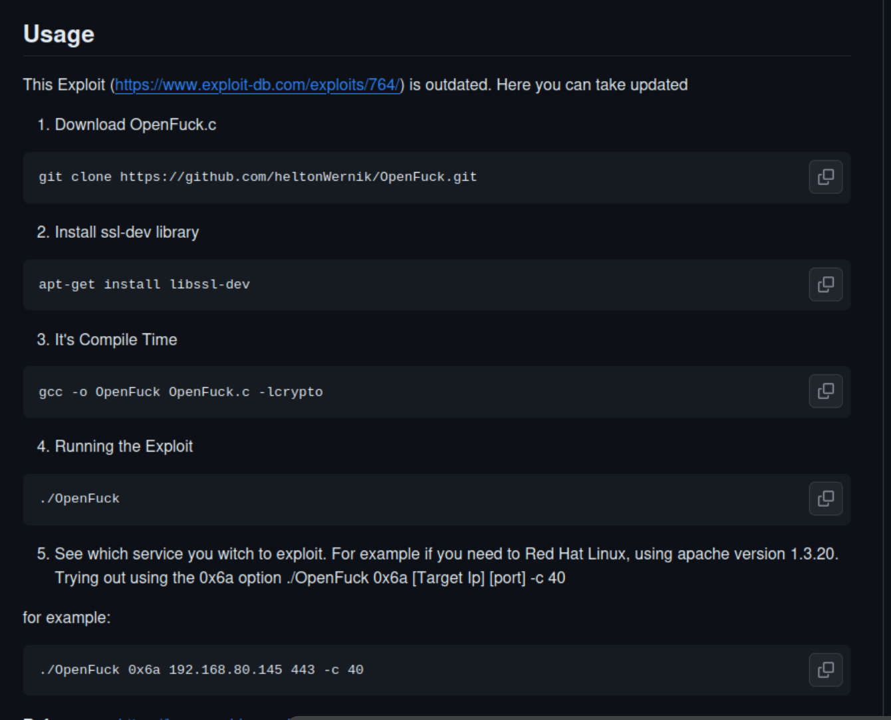
select apache version we found in scaning.
use 0x6b, if a not works

**Explited!.🎉🎉🎉**
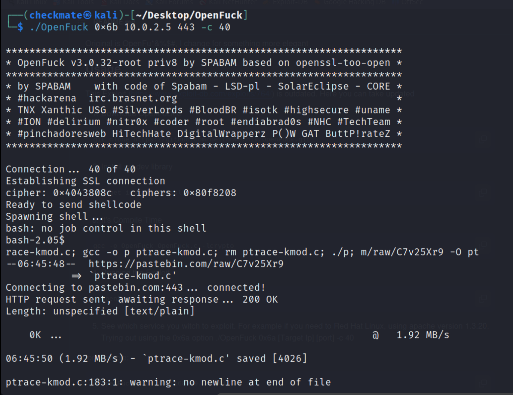
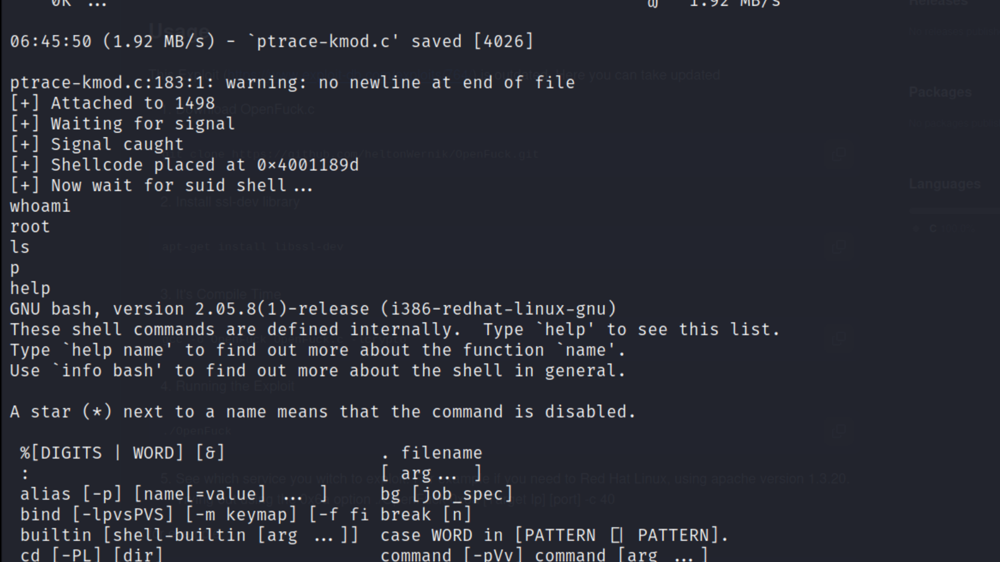

# Bruteforcing ssh
## using hydra
-Command: 
`hydra -l root -P `

# Credential stuffing
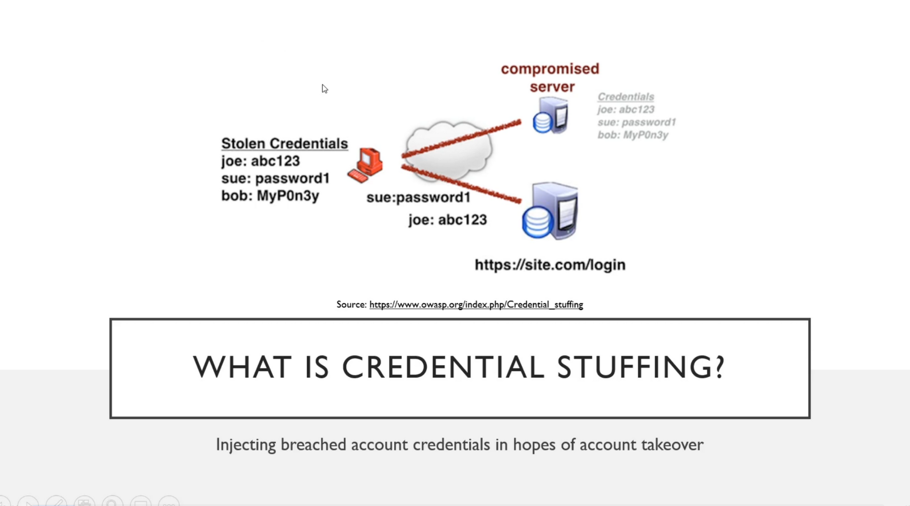