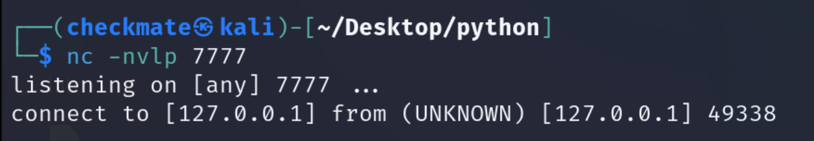

7. Intro To Python

# Socket Connection
### Command to start listener at port


### Code to test connectivity to host and port

```py
#!/bin/python3
import socket # importing socket module

HOST = '127.0.0.1'
PORT = 7777

# AF_INET is ipv4, SOCK_STREAM is port number
s = socket.socket(socket.AF_INET, socket.SOCK_STREAM)
s.connect((HOST, PORT))
```

# Port Scanner
```py
#!/bin/python3

import sys
import socket
from datetime import datetime

if len(sys.argv) == 4:
	# translate hostname to IPv4
	target = socket.gethostbyname(sys.argv[1])

	try:
		start = int(sys.argv[2])
		end = int(sys.argv[3])
		if start > end or start < 0 or end < 0 or start > 65535 or end > 65535:
			print("Invalid port range passed")
			print("Syntax: python3 port_scanner.py <ip> <start_port> <end_port>")
			sys.exit()
	except:
		print("Invalid port number passed")
		sys.exit()
else:
	print("Invalid amount of arguments.")
	print("Syntax: python3 port_scanner.py <ip> <start_port> <end_port>")
	sys.exit()

print("-" * 50)
print("Scanning: " + target)
print(f"Time started: {datetime.now()}")
print("-" * 50)

try:
	for port in range(start, end+1):
		s = socket.socket(socket.AF_INET, socket.SOCK_STREAM)
		socket.setdefaulttimeout(1)

		result = s.connect_ex((target, port))
		if result == 0:
			print(f"Port {port} is open")
		#else:
			#print(f"Port {port} is closed")
		s.close()
except KeyboardInterrupt:
	print("Exiting scanner")
	sys.exit()
except socket.gaierror:
	print("Hostname could not be resolved")
	sys.exit()
except socket.error:
	print("Could not connect to the host")
	sys.exit()
```
