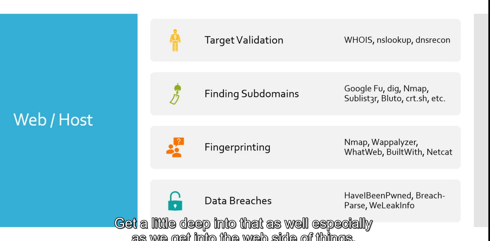

9. Information Gathering

# 1. Passive Reconnaissance Overview

# 2. Find targets?
https://bugcrowd.com/programs

# 3. E-mail OSINT

### Find Emails:
1. https://hunter.io/
2. https://phonebook.cz/
3. https://www.voilanorbert.com/
4. https://chromewebstore.google.com/detail/clearbit-connect-free-ver/pmnhcgfcafcnkbengdcanjablaabjplo

### Verify Emails
1. https://tools.emailhippo.com/
2. https://email-checker.net/validate

# 4. Breached Passwords:
1. https://github.com/hmaverickadams/breach-parse

# 5. Breached Credentials
### search credentials
https://www.dehashed.com/

### for hash
https://github.com/rarecoil/hashes.org-list

# 6-7. Hunting Subdomains
### Sublister
`apt install sublist3r`

### Certificate Search
https://crt.sh/

### OWASP AMASS
https://github.com/owasp-amass/amass

# 8. Idenitify target techs
1. https://builtwith.com/
2. https://www.wappalyzer.com/apps/
3. whatweb \<webiste>

# 9. Information Burp Suite

# 10. Google Fu
Google search operators:
https://ahrefs.com/blog/google-advanced-search-operators/

# 11. Social Media
Pictures, etc