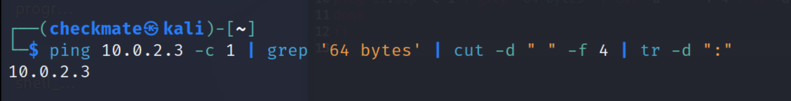
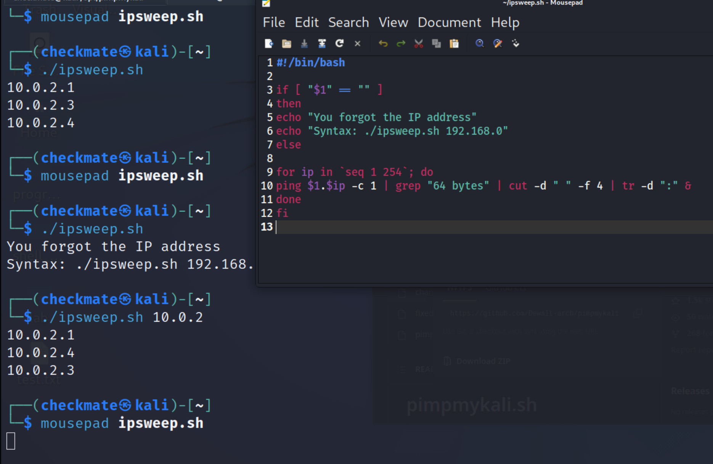
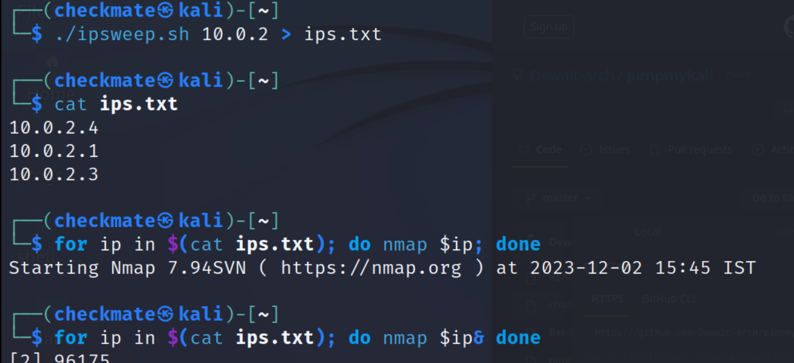

Bash Scripting
# IP Sweeper script




```
#!/bin/bash

if [ "$1" == "" ]
then
echo "You forgot the IP address"
echo "Syntax: ./ipsweep.sh 192.168.0"
else

for ip in `seq 1 254`; do
ping $1.$ip -c 1 | grep "64 bytes" | cut -d " " -f 4 | tr -d ":" &
done
fi
```