*For command explanation:* https://explainshell.com/
*or* **man \<command>**
* * *

# Admin commands: 

- ## sudo
To run commands with priviliged (root) mode.
**Usage: sudo <command_name>**

**Normal:**
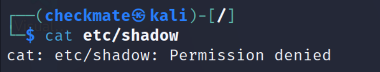
**Sudo:**
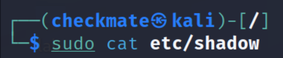

**Run all commands in root by switch to root mode using:**
 **Command: sudo su -**
 su: superuser
 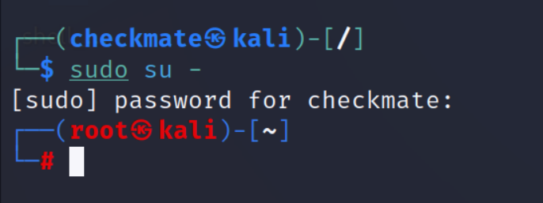

- ## passwd
Change password of user

- ## adduser
creates new user.
**Usage: sudo adduser  \<new_user>**

- ## su 
Switch to user
**Usage: su \<user>**

- ## sudo -l
Which commands can be ran
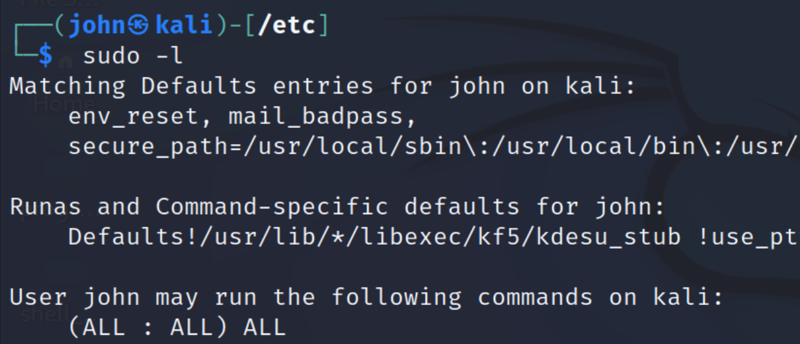

# File Navigation:

- ## cd
Change to directory
**Usage:  cd <dir_name>** 
**cd ..** : go one level back to dir

- ## mkdir
Create new directory
**Usage: mkdir <dir_name>**

- ## rmdir
Remove/delete directory
**Usage: rmdir <dir_name>**

- ## ls
 List contents of directory
 **Usage: ls**
 Use **ls -la**  for more info and include hidden files
 
- ## cp
Copy file
**Usage: cp <file_name> <copy_location>**

- ## mv
Move/rename file
**Usage: mv <file_name> <new_location>**
To rename insert new file name in place of new location

- ## locate
To search/locate file
**Usage: locate**
To update file locate database:  **sude updatedb**

- ## grep
To narrow down search of text in file
**Usage: grep 'keyword' \<file>**
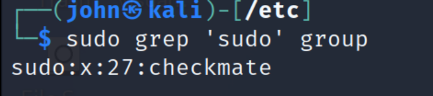

> ## file permissions:
r: read (4)
w: write (2)
x: execute (1)

3 groups: owner, group, current_user

**To change permissions:**
**chmod** comnand is used

First way:
**chmod +{rwx}**: add r,w,x permission

Second Way (octal):
**chmod 777**: rwx for all 3 groups

- r = 4
- w = 2
- x = 1
- rw = 4+2
- rwx = 7

# Networking:

- ## ip a [colorful] (old- ifconfig)
to show network info like ip etc.
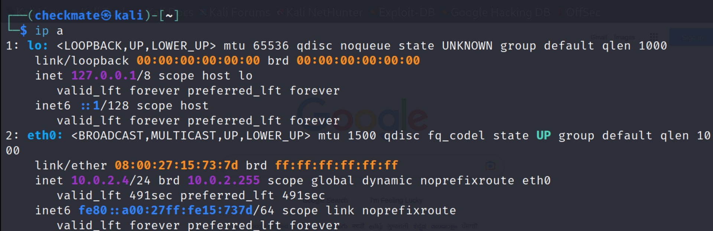

- ## iwconfig
to show wireless connections.
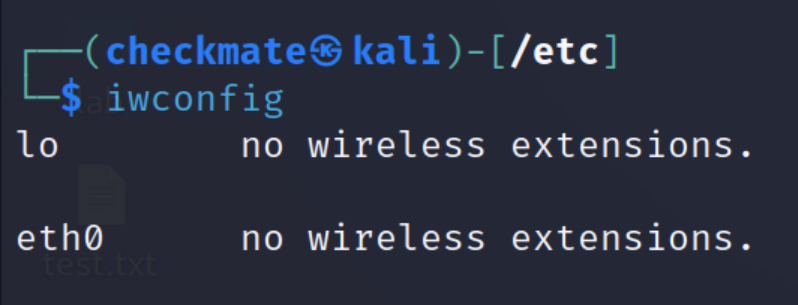

-## ip n | arp -a
shows what ip address is asscoiated with what mac address.
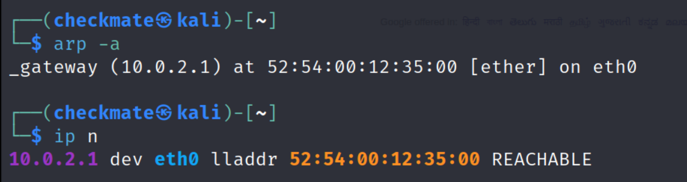

-## ip r | route
to know routing table
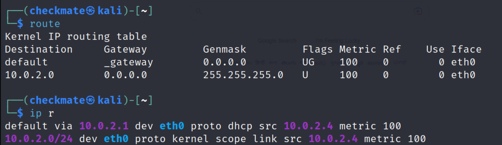

- ## ping \<ip> or \<address>
to know connectivity with ip
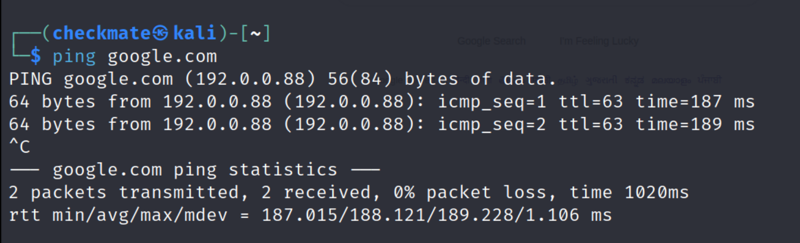

- ## netstat

# View, Create, Edit files:
- ## echo "content" > file
write content in file
**>** for overwrite
**>>** for append
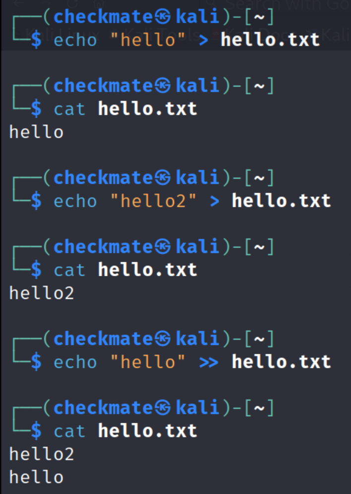

- ## touch \<file>
to create empty file
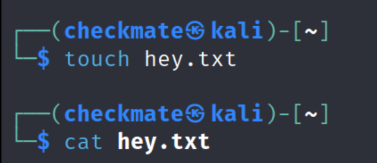

- ## cat \<filename>
to create, view and concatenate files
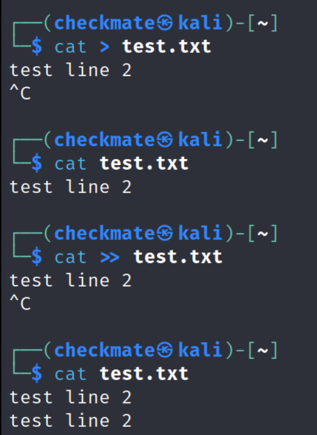
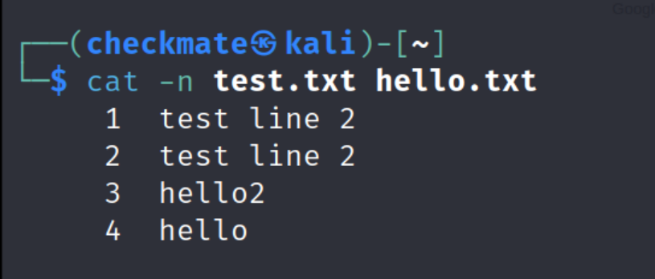

- ## nano \<filename>
terminal editor for creating and editing file
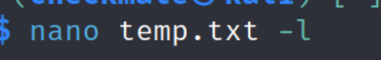
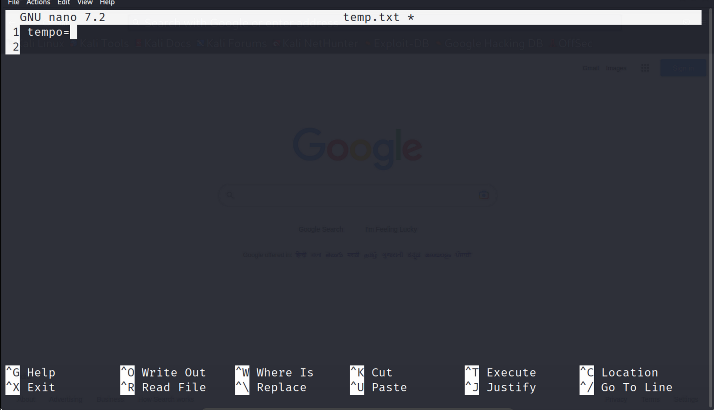

- ## mousepad \<filename>
to view, edit file in mousepad (similar to notepad)
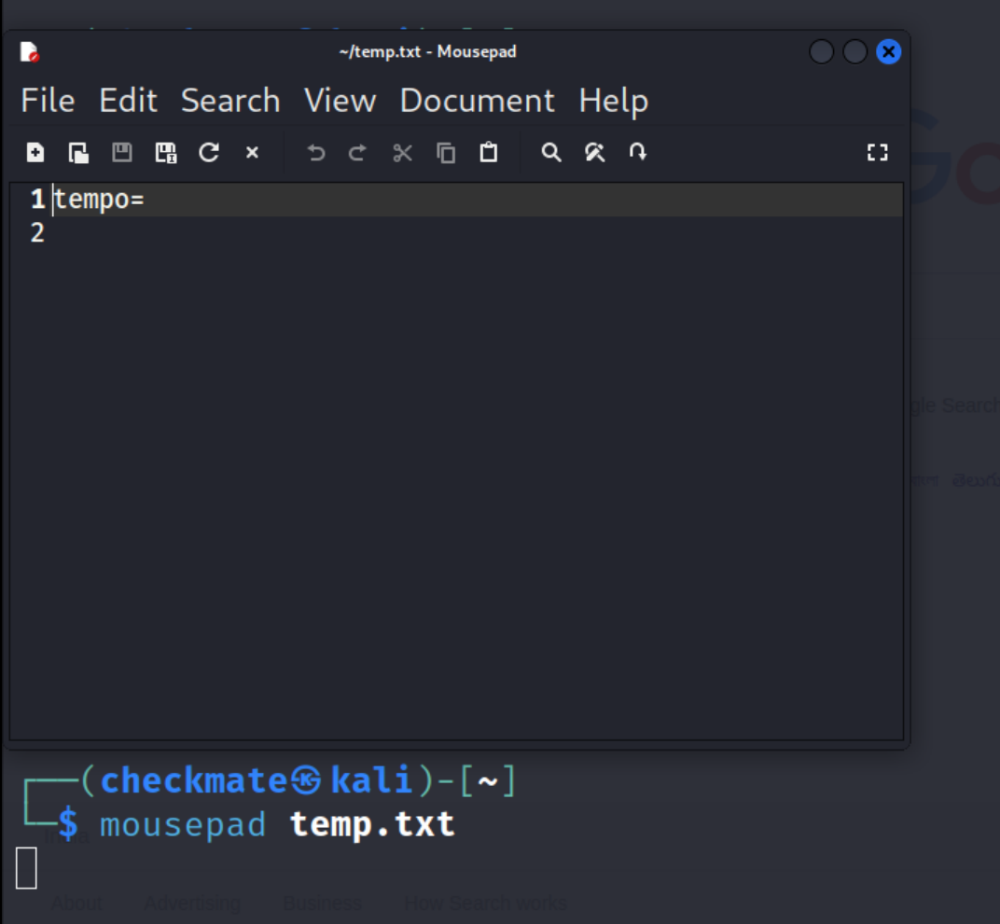

# Start / Stop services:
- ## start/stop apache web server
### sudo service apache2 start/stop
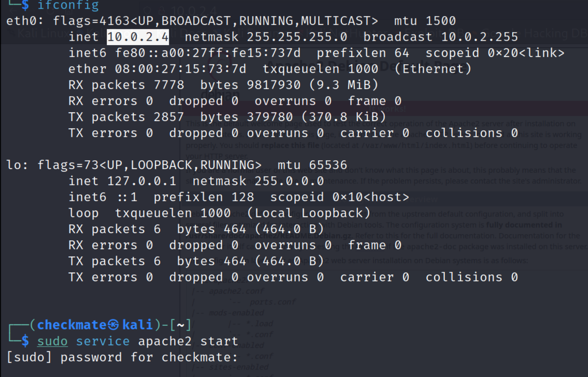
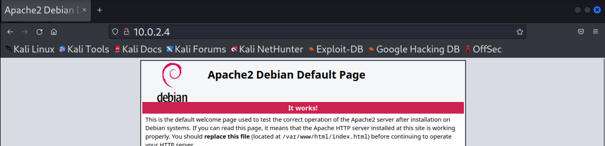

### direct from where files are served
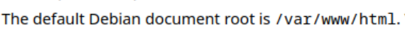
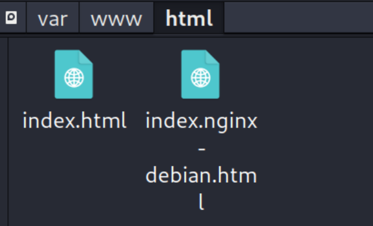
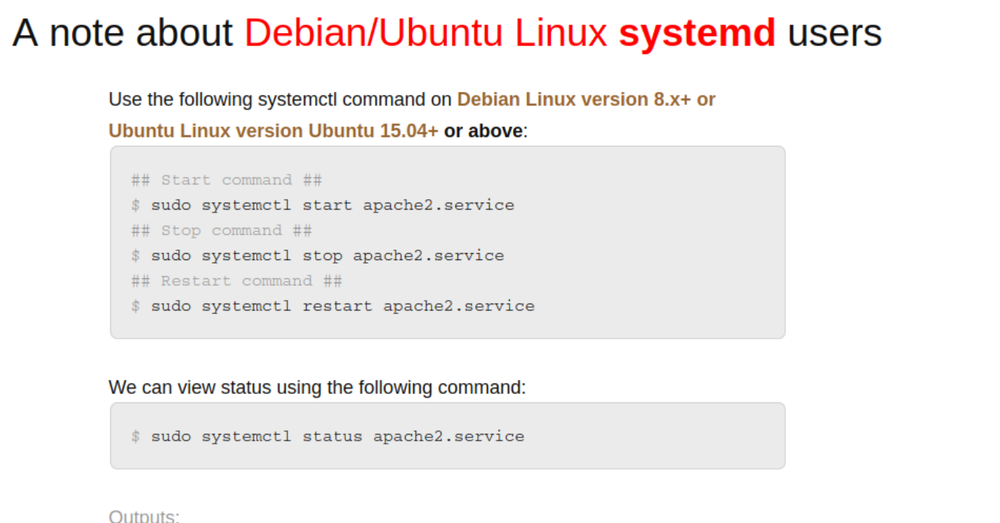
https://www.cyberciti.biz/faq/star-stop-restart-apache2-webserver/

- ## to start python web server
### python3 -m http.server 80 
80 is port number
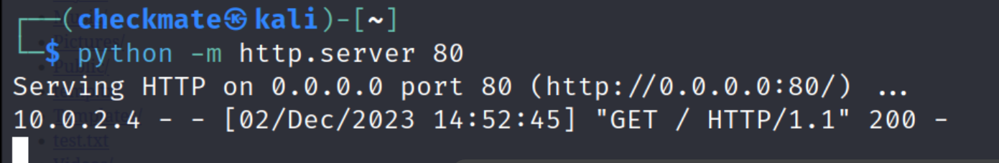
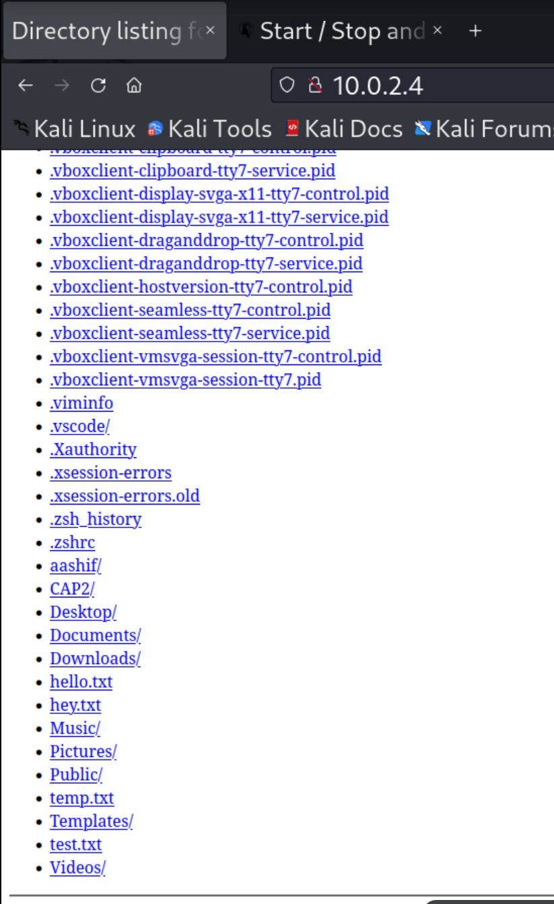

- ## sudo systemctl <start/stop/status> \<service>
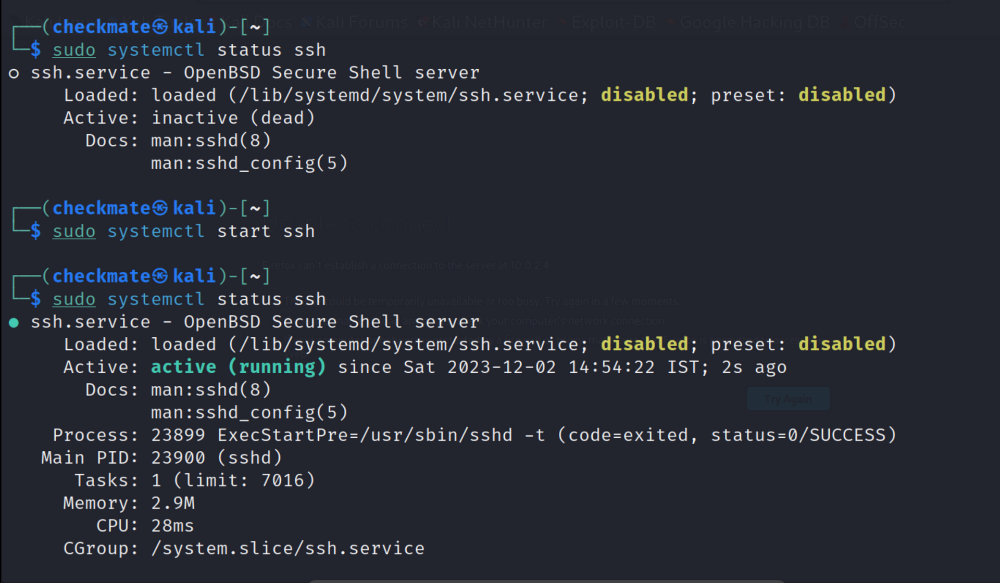
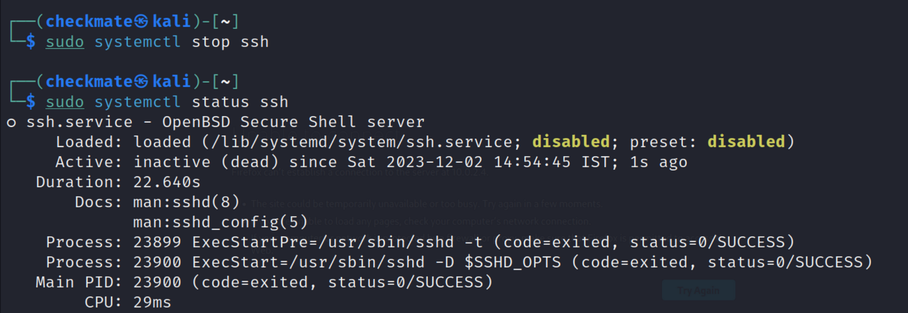

# Installing / Updating apps:
- ## Update (root user may required)
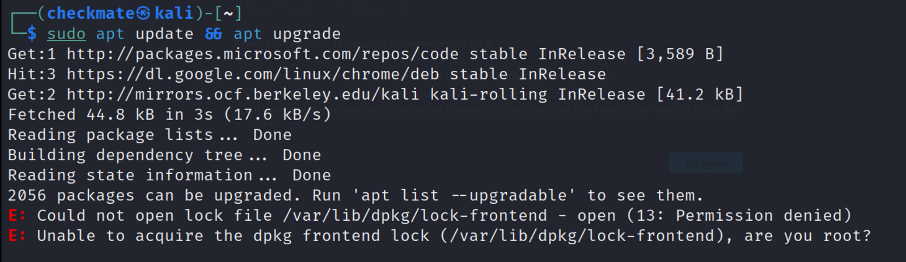

- ## Install
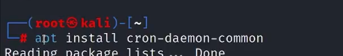

# Installing via Git:
### in (/opt) directory
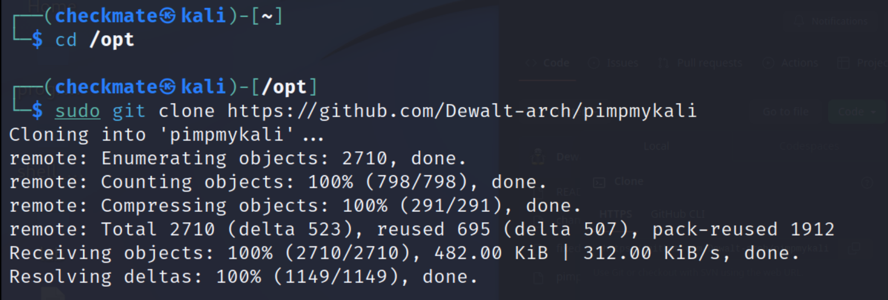
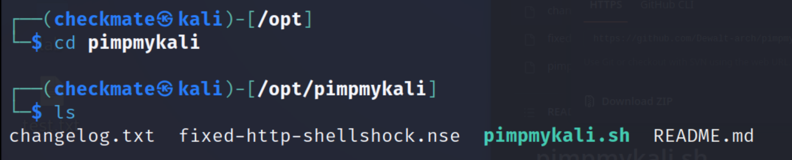
